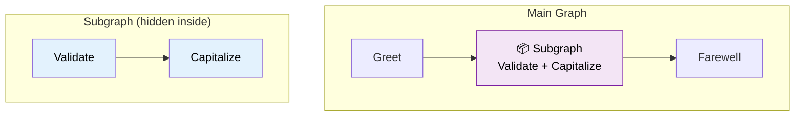

# 33 — Subgraphs

## What are subgraphs?

A subgraph is a **graph inside a graph**. You compile an inner `StateGraph` and add it as a node in the outer graph. The outer graph sees the subgraph as a single step, but internally it runs its own nodes and edges.



## What you'll learn

- Compile a `StateGraph` separately → subgraph
- Add subgraph as a node via `add_node(name, subgraph.compile())`
- The outer graph treats it as a single step

## Code Walkthrough

```python
sub_builder = StateGraph(SubState)
sub_builder.add_node("validate", validate)
sub_builder.add_node("capitalize", capitalize)
sub_builder.add_edge(START, "validate")
sub_builder.add_conditional_edges("validate", lambda s: "capitalize" if s["text"] != "INVALID" else END, ...)
subgraph = sub_builder.compile()

builder.add_node("subgraph", subgraph)  # ← compiled graph as a node
builder.add_edge("greet", "subgraph")
```

**What each piece does:**
- `sub_builder.compile()` — Compiles a **separate** `StateGraph`. The resulting `subgraph` is a `CompiledStateGraph` — it has its own `.invoke()`, `.stream()`, etc.
- `add_node("subgraph", subgraph)` — Adds the compiled subgraph as a single **node** in the outer graph. The outer graph treats it like any other node — it just runs and returns.
- **State isolation** — The subgraph has its own `SubState` TypedDict. It doesn't see the outer graph's state fields unless you pass them explicitly.
- **Return value** — The subgraph's **final state** becomes the output. The outer node receives this state as if the subgraph were a regular function.

**Why subgraphs:** Reuse. You build a validation pipeline once, compile it, and drop it into any graph as a single node.

## Key idea

Subgraphs let you **compose** complex agents from reusable pieces. Each subgraph has its own internal state and logic.
