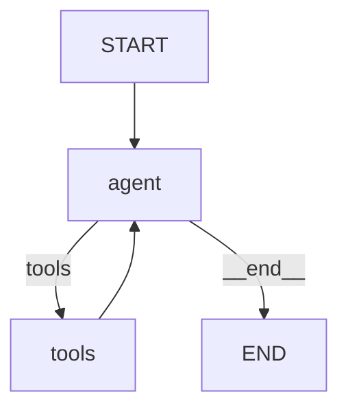

# 34 — Graph Visualization

## What is graph visualization?

LangGraph can **draw** your graph as a Mermaid diagram. This is invaluable for debugging complex graphs — you can see exactly how nodes connect.

The diagram above was generated by `get_graph().draw_mermaid()`.

## What you'll learn

- `get_graph()` — get a drawable representation
- `draw_mermaid()` — output Mermaid syntax
- `draw_png()` — render as PNG image

## Key idea

Always visualize your graph when debugging. It reveals routing mistakes, missing edges, and unintended loops instantly.
