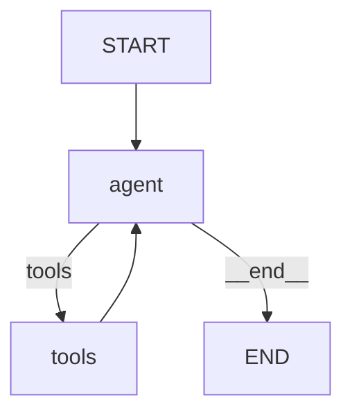

# 34 — Graph Visualization

## What is graph visualization?

LangGraph can **draw** your graph as a Mermaid diagram. This is invaluable for debugging complex graphs — you can see exactly how nodes connect.



The diagram above was generated by `get_graph().draw_mermaid()`.

## What you'll learn

- `get_graph()` — get a drawable representation
- `draw_mermaid()` — output Mermaid syntax
- `draw_png()` — render as PNG image

## Code Walkthrough

```python
print(graph.get_graph().draw_mermaid())
print(graph.get_graph().draw_ascii())
```

**What each method does:**
- `get_graph()` — Returns a `Graph` representation of the compiled graph. This is a **static** description — nodes, edges, and conditional branches. It's not the live execution.
- `draw_mermaid()` — Outputs a Mermaid flowchart string. Paste it into any Mermaid renderer (GitHub markdown, mermaid.live) to see the diagram. Shows `START` → nodes → conditional edges (with labels) → `END`.
- `draw_ascii()` — Outputs a simple ASCII diagram. Less pretty but works in any terminal. Useful for quick debugging without a browser.
- `draw_png(output_file_path)` — Renders the graph as a PNG image. Requires additional dependencies (graphviz). Not shown in the lesson but available.
- `Node count` — `len(graph.get_graph().nodes)` shows how many nodes are in the graph. Useful for sanity-checking complex graphs.

## Key idea

Always visualize your graph when debugging. It reveals routing mistakes, missing edges, and unintended loops instantly.
