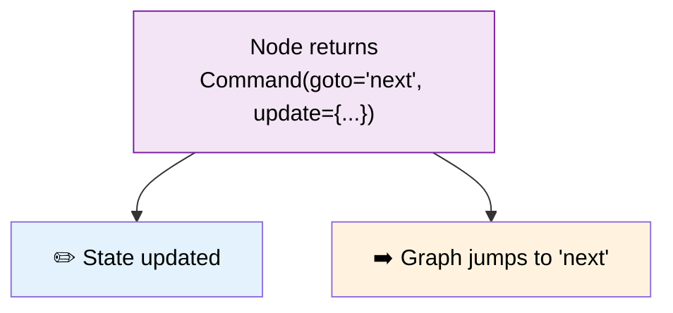

# 35 — Command (Multi-Action)

## What is Command?

`Command` lets a node do **multiple things at once**: update state, add messages, jump to a specific node, and resume from an interrupt — all in one return.



## What you'll learn

- `Command(goto=node_name)` — jump to a specific node
- `Command(update=dict)` — update state directly
- `Command(resume=value)` — resume from interrupt
- Combining all three in one return

## Code Walkthrough

```python
from langgraph.types import Command

def validate(state: State) -> Command:
    if is_valid:
        return Command(goto="process", update={"validated": True})
    else:
        return Command(goto="fix", update={"validated": False, "input": fixed_text})
```

**What each piece does:**
- `Command(goto="process", update={"validated": True})` — **Two things at once**: ① Jump to the `"process"` node next (skip the normal edge). ② Update the state with `validated: True`. Both happen in a single return.
- `Command(goto="fix")` — Just jump, no state update. The node returned control flow instructions without modifying state.
- `Command(resume="value")` — Resume from an `interrupt()` with a value. Used in human-in-the-loop lessons.
- **Without Command** — A node can only return `{"field": "value"}` — state updates. The graph decides where to go next based on edges.
- **With Command** — A node can say "go to node X AND update these fields". It's the **only way** to dynamically change the next node from inside a node function.

**The flow:** validate → if valid: Command(goto="process", update={...}) → process runs → END. If invalid: Command(goto="fix", update={...}) → fix runs → then (via edge) process runs → END.

## Key idea

Without `Command`, a node can only return state updates. With `Command`, it can **control the flow** — jump, update, and resume in one shot.
