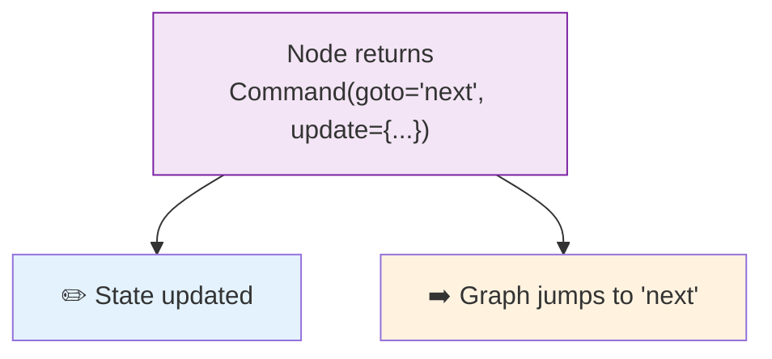

# 35 — Command (Multi-Action)

## What is Command?

`Command` lets a node do **multiple things at once**: update state, add messages, jump to a specific node, and resume from an interrupt — all in one return.

## What you'll learn

- `Command(goto=node_name)` — jump to a specific node
- `Command(update=dict)` — update state directly
- `Command(resume=value)` — resume from interrupt
- Combining all three in one return

## Key idea

Without `Command`, a node can only return state updates. With `Command`, it can **control the flow** — jump, update, and resume in one shot.
