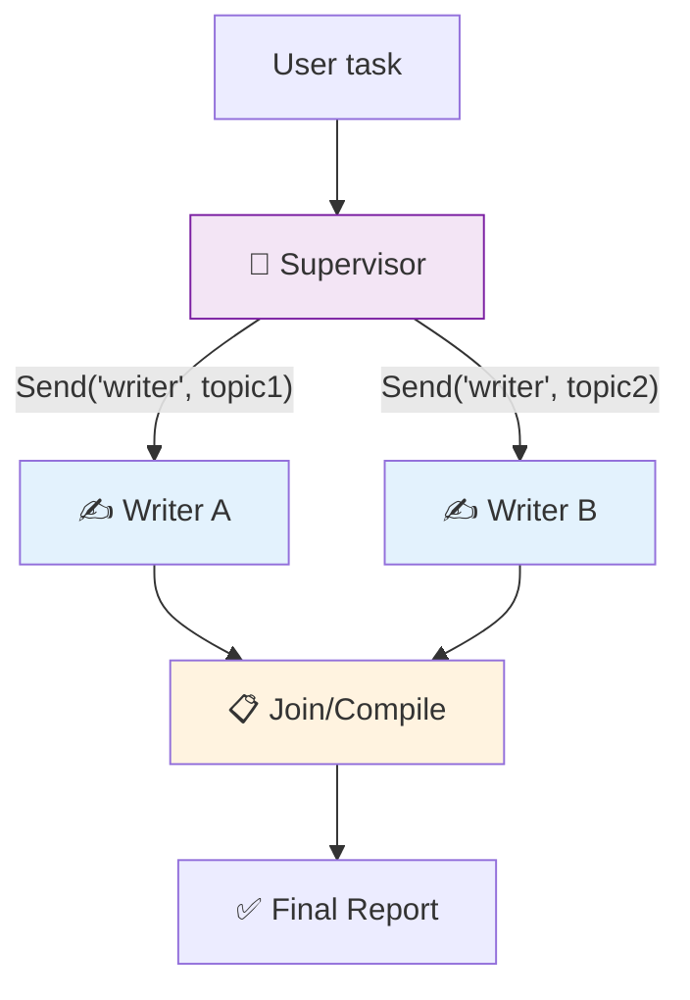

# 36 — Supervisor/Worker Agent

A **supervisor** agent receives a task, breaks it into subtasks, and dispatches each to a **worker** using `Send`. Workers report back, and the supervisor compiles the final answer.

## What you'll build

- Supervisor that splits a task into parts
- Workers that execute in parallel via `Send`
- A join node that compiles results
- `operator.add` reducer to merge worker outputs
