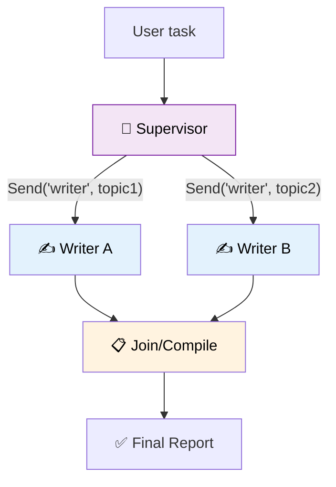

# 36 — Supervisor/Worker Agent

A **supervisor** agent receives a task, breaks it into subtasks, and dispatches each to a **worker** using `Send`. Workers report back, and the supervisor compiles the final answer.



## Code Walkthrough

```python
class State(TypedDict):
    task: str
    topics: list[str]
    sections: Annotated[list[str], operator.add]
    report: str

def supervisor(state: State) -> dict:
    response = llm.invoke(f"Break this task into 3 subtopics. One per line:\n{state['task']}")
    topics = [t.strip("- ").strip() for t in response.content.strip().split("\n") if t.strip()]
    return {"topics": topics[:3]}

def router(state: State) -> list[Send]:
    return [Send("worker", {"topic": t}) for t in state["topics"]]

def worker(state: dict) -> dict:
    response = llm.invoke(f"Write 2 sentences about: {state['topic']}")
    return {"sections": [f"## {state['topic']}\n{response.content.strip()}"]}

def joiner(state: State) -> dict:
    return {"report": "\n\n".join(state["sections"])}
```

**What each node does:**
- **`supervisor`** — The boss. Takes the user's task, asks the LLM to split it into 3 subtopics, and stores them in `state["topics"]`.
- **`router`** — Not a node, but a **conditional edge function**. Creates one `Send` per topic. Each `Send` targets the `"worker"` node with a custom state `{"topic": "..."}`. All workers run in **parallel**.
- **`worker`** — Writes 2 sentences about one topic. Returns a section which gets merged into `state["sections"]` via `operator.add`.
- **`joiner`** — Collects all sections and joins them into a final report with double newlines.

**Data flow:** task → supervisor splits into topics → router fans out 3 `Send` objects → 3 workers run in parallel → each appends a section → joiner merges into final report.

## What you'll build

- Supervisor that splits a task into parts
- Workers that execute in parallel via `Send`
- A join node that compiles results
- `operator.add` reducer to merge worker outputs
