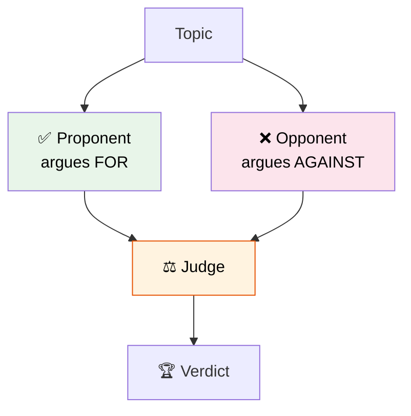

# 37 — Debate Agents

Two agents with opposing personas debate a topic. A third **judge** reads their arguments and declares a winner.



## Code Walkthrough

```python
builder = StateGraph(State)
builder.add_node("proponent", proponent)
builder.add_node("opponent", opponent)
builder.add_node("judge", judge)
builder.add_edge(START, "proponent")
builder.add_edge(START, "opponent")
builder.add_edge("proponent", "judge")
builder.add_edge("opponent", "judge")
```

**What each node does:**
- **`proponent`** — Arguer FOR the topic. System prompt: "You argue IN FAVOR of everything." Returns a persuasive argument.
- **`opponent`** — Arguer AGAINST the topic. System prompt: "You argue AGAINST everything." Returns a critical argument.
- **`judge`** — Reads both arguments, evaluates them, and declares a winner with reasoning.
- **Two START edges** — Both proponents run in **parallel** from START. The graph doesn't wait for one before starting the other.
- **Both feed into judge** — The judge runs only after BOTH proponent AND opponent complete.

**Data flow:** Topic → proponent (parallel) + opponent (parallel) → judge reads both → verdict.

## What you'll build

- Two agents with different system prompts (pro vs con)
- A judge agent that evaluates both sides
- Parallel execution via graph branching
- Conditional edge for the verdict
