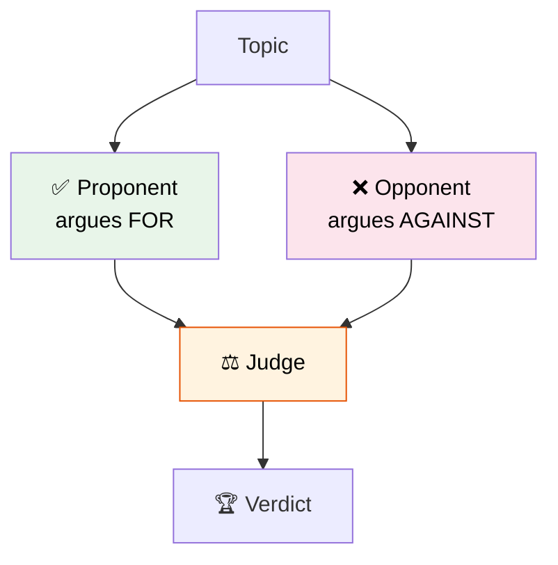

# 37 — Debate Agents

Two agents with opposing personas debate a topic. A third **judge** reads their arguments and declares a winner.

## What you'll build

- Two agents with different system prompts (pro vs con)
- A judge agent that evaluates both sides
- Parallel execution via graph branching
- Conditional edge for the verdict
