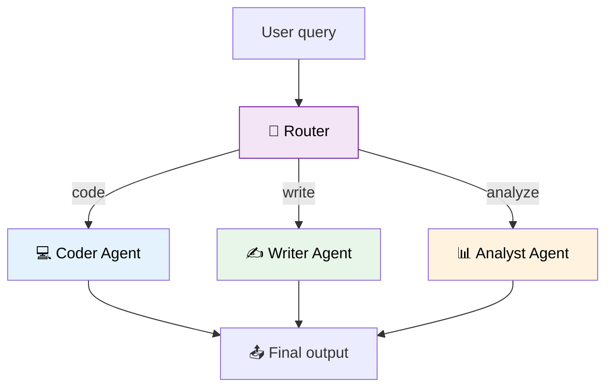

# 38 — Agent Router Team

A **router** agent examines a user query and sends it to the right specialist agent: a coder, a writer, or an analyst.



## Code Walkthrough

```python
def router(state: State) -> dict:
    prompt = f"Categories: code, write, analyze. Which fits? Reply with just the word: {state['query']}"
    cat = llm.invoke(prompt).content.strip().lower()
    return {"category": cat}

def run_specialist(state: State) -> dict:
    agent = specialists[state["category"]]
    result = agent.invoke({"messages": [HumanMessage(state["query"])]})
    return {"output": result["messages"][-1].content}

builder.add_conditional_edges("router", route, {"code": "code", "write": "write", "analyze": "analyze"})
```

**What each piece does:**
- **`router`** — An LLM classifies the query into one of 3 categories. The LLM's response is stored in `state["category"]`.
- **`specialists` dict** — Maps category names to pre-built `create_react_agent` instances. Each specialist has a different system prompt and tool set.
- **`run_specialist`** — A single node that handles ALL categories. It looks up the right agent from `specialists[state["category"]]` and invokes it.
- **Conditional edge** — Routes from `"router"` to one of 3 nodes (`"code"`, `"write"`, `"analyze"`) based on the category. But all 3 nodes call the same `run_specialist` function — just with different agent instances.

## What you'll build

- `RouterRunnable` to route between specialist `create_agent` instances
- Three agents with different system prompts and tools
- Conditional edge routing from the router's output
