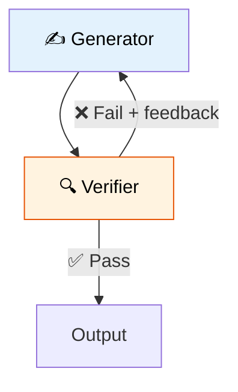

# 39 — Generator + Verifier

One agent **generates** content, another **verifies** it. If verification fails, the generator tries again with feedback. This creates a quality loop.

## What you'll build

- Generator agent that creates content
- Verifier agent that scores output (pass/fail)
- Conditional edge that loops back on failure
- Max retry limit to prevent infinite loops
