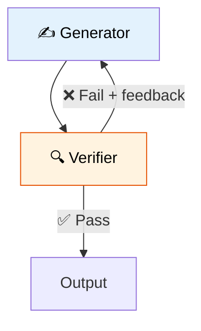

# 39 — Generator + Verifier

One agent **generates** content, another **verifies** it. If verification fails, the generator tries again with feedback.



## Code Walkthrough

```python
def generate(state: State) -> dict:
    prompt = f"Write a clear explanation of: {state['topic']}"
    if state.get("feedback"):
        prompt += f"\n\nPrevious feedback to address: {state['feedback']}"
    return {"draft": llm.invoke(prompt).content, "attempts": state["attempts"] + 1}

def verify(state: State) -> dict:
    result = llm.invoke(f"Evaluate. Score pass/fail. If fail, explain why:\n{state['draft']}")
    passed = "pass" in result.content.lower()
    return {"passed": passed, "feedback": result.content if not passed else ""}

def should_continue(state: State) -> str:
    if state["passed"] or state["attempts"] >= 3:
        return "end"
    return "generate"
```

**What each piece does:**
- **`generate`** — Creates content. Tracks `attempts`. If there's previous `feedback`, incorporates it to improve. Returns the draft and increments the attempt counter.
- **`verify`** — Evaluates the draft. Sets `passed: True` or `False`. On failure, stores detailed `feedback` so the generator knows what to fix.
- **`should_continue`** — Conditional edge: if passed OR max attempts reached, go to `END`. Otherwise, loop back to `generate` with feedback.
- **Max attempts** — Prevents infinite loops. After 3 tries, accepts whatever we have.

**Data flow:** generate → verify → (pass → END) OR (fail + feedback → generate again) → loop up to 3 times.

## What you'll build

- Generator agent that creates content
- Verifier agent that scores output (pass/fail)
- Conditional edge that loops back on failure
- Max retry limit to prevent infinite loops
