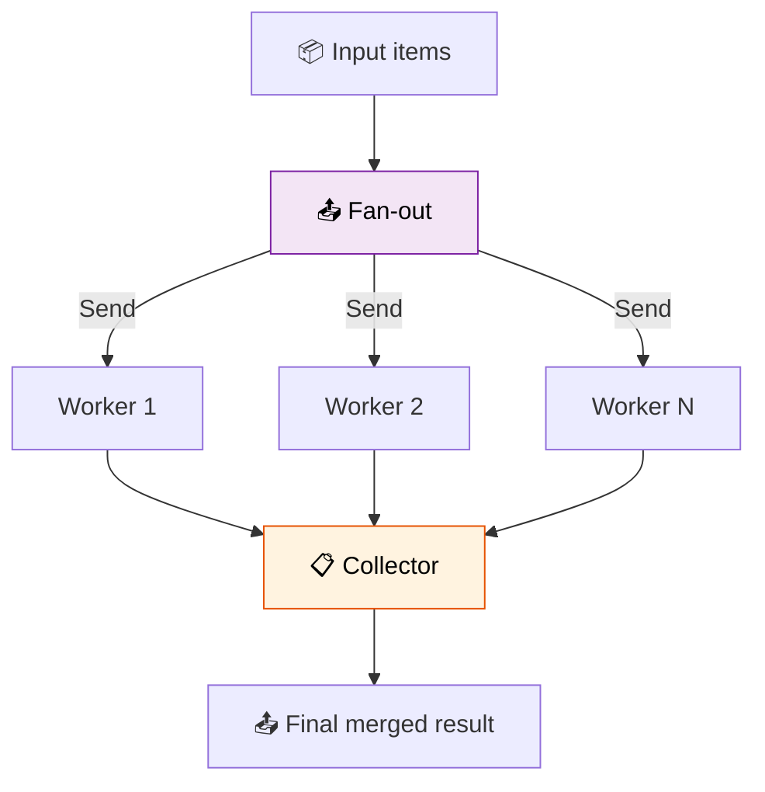

# 40 — Map-Reduce Swarm

A swarm of identical workers processes items in parallel (map), then a collector merges results (reduce).



## Code Walkthrough

```python
def route_items(state: State) -> list[Send]:
    return [Send("worker", {"item": item}) for item in state["items"]]

def worker(state: dict) -> dict:
    response = llm.invoke(f"Summarize: {state['item']}")
    return {"results": [f"- {response.content.strip()}"]}

def collector(state: State) -> dict:
    return {"final": "\n".join(state["results"])}
```

**What each piece does:**
- **`route_items`** — Creates one `Send` per input item. Each sends to `"worker"` with a custom state `{"item": "..."}`. All workers run in **parallel**.
- **`worker`** — Takes one item, summarizes it, returns the result. The `operator.add` reducer on `results` appends each worker's output to the growing list automatically.
- **`collector`** — Joins all individual results into a single formatted string.
- **`operator.add`** on `Annotated[list[str], operator.add]` — Merges lists from parallel workers. No need for manual merging.

**Data flow:** items → route_items creates N `Send` objects → N workers run in parallel → each appends a result → collector joins them → final output.

## What you'll build

- `Send` fan-out to N parallel workers
- Worker agents that process one item each
- `operator.add` reducer for automatic merging
- Collector node for final formatting
