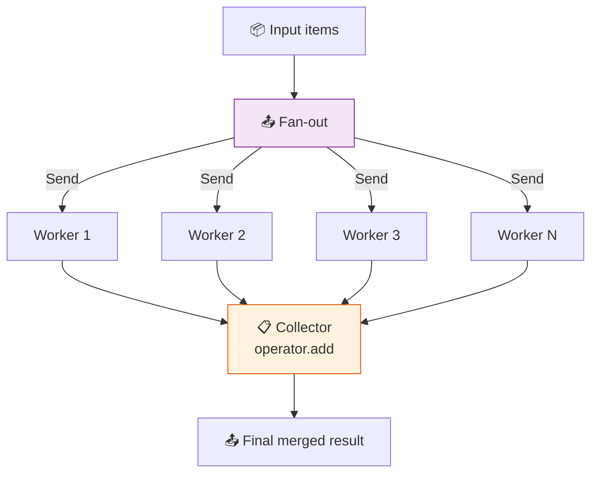

# 40 — Map-Reduce Swarm

A **swarm** of identical worker agents processes items in parallel (map phase), then a **collector** merges results (reduce phase).

## What you'll build

- `Send` fan-out to N parallel workers
- Worker agents that process one item each
- `operator.add` reducer for automatic merging
- Collector node for final formatting
