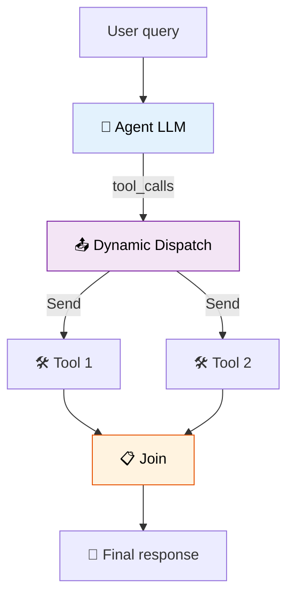

# 41 — Dynamic Tool Swarm

The LLM decides **which tools to call** — each becomes a parallel worker via `Send`.



## Code Walkthrough

```python
def agent(state: State) -> dict:
    return {"messages": [llm_with_tools.invoke(state["messages"])]}

# Conditional edge: fans out one Send per tool call
lambda s: [Send("tool_runner", {"tc": tc}) for tc in (s["messages"][-1].tool_calls if hasattr(...) else [])]

def tool_runner(state: dict) -> dict:
    tc = state["tc"]
    tool = tool_map.get(tc["name"])
    result = tool.invoke(tc["args"])
    return {"tool_outputs": [f"{tc['name']} = {result}"]}
```

**What each piece does:**
- **`agent`** — LLM decides which tools to call. The number of `tool_calls` is **dynamic** — it depends on the query. For "calculate 5*3 and weather in Paris", it might make 2 calls. For "just say hello", it makes 0.
- **Conditional edge** — If `tool_calls` exist, creates one `Send("tool_runner", ...)` per call. If no tools, returns `[]` and the graph ends. The **count of workers is determined at runtime** by the LLM.
- **`tool_runner`** — Executes one tool call. Each runs in its own parallel invocation.
- **`final_answer`** — After all tools complete, the LLM generates a final response incorporating all tool outputs.

**Data flow:** query → LLM decides tool count → one `Send` per tool → tools run in parallel → all outputs merged → final answer.

## What you'll build

- LLM decides how many tools to call
- `Send` fans out to one worker per tool call
- Join node collects all results
- LLM generates final answer from all tool outputs
