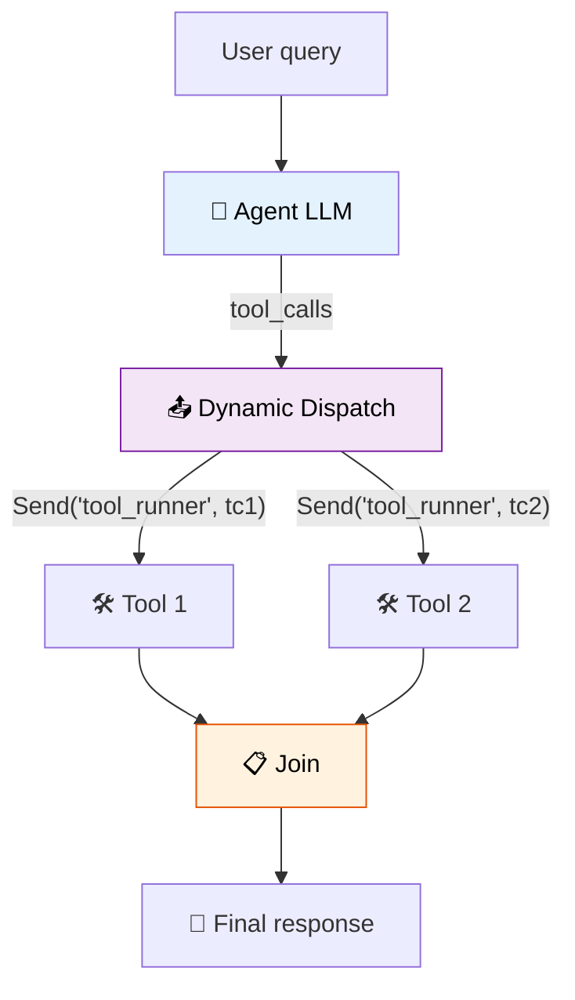

# 41 — Dynamic Tool Swarm

An LLM decides **which tools to call and how many workers to spawn** based on the task. Each tool call becomes a parallel worker via `Send`.

## What you'll build

- LLM decides how many tools to call
- `Send` fans out to one worker per tool call
- Join node collects all results
- LLM generates final answer from all tool outputs
