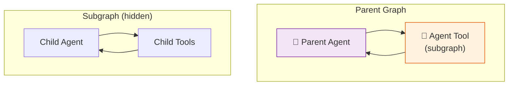

# 42 — Nested Agent Teams

A parent agent treats a child agent as a **tool**. The child agent runs its own graph internally, and the parent sees only the final result.

## What you'll build

- A child agent compiled as a subgraph
- The subgraph wrapped as a `Tool`
- Parent agent calls the tool like any other function
- Subgraph runs its own internal loop
