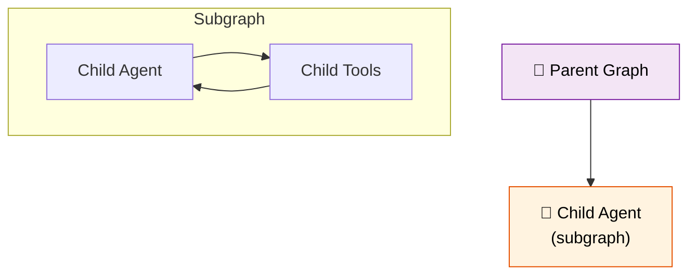

# 42 — Nested Agent Teams

A parent agent treats a child agent as a **subgraph**. The child runs its own internal loop, and the parent sees only the result.



## Code Walkthrough

```python
child_agent = create_react_agent(llm.bind_tools(child_tools), child_tools,
    prompt="You are a research assistant.", name="research_agent")

def call_child_agent(state: MessagesState) -> dict:
    result = child_agent.invoke({"messages": state["messages"] + [HumanMessage("...")]})
    return {"messages": result["messages"]}

builder.add_node("child_agent", call_child_agent)
```

**What each piece does:**
- **`create_react_agent(name="research_agent")`** — Creates a compiled LangGraph agent. The `name` parameter identifies it as a subgraph for debugging.
- **`call_child_agent`** — A regular node in the parent graph. Inside it, it calls `child_agent.invoke(...)` — invoking the **entire subgraph** as a single step. The subgraph runs its own loop: agent → tools → agent → tools → ... → stops.
- **Subgraph isolation** — The child agent has its OWN state (messages). It doesn't share state with the parent unless you explicitly pass data.
- **Result** — The child's final messages are appended to the parent's state. The parent sees only the output, not the internal steps.

**Data flow:** parent → calls child.invoke() → child runs full ReAct loop internally → child returns final messages → parent continues.

## What you'll build

- A child agent compiled as a subgraph
- The subgraph wrapped as a node in the parent
- Parent calls the child like any other function
- Subgraph runs its own internal loop
