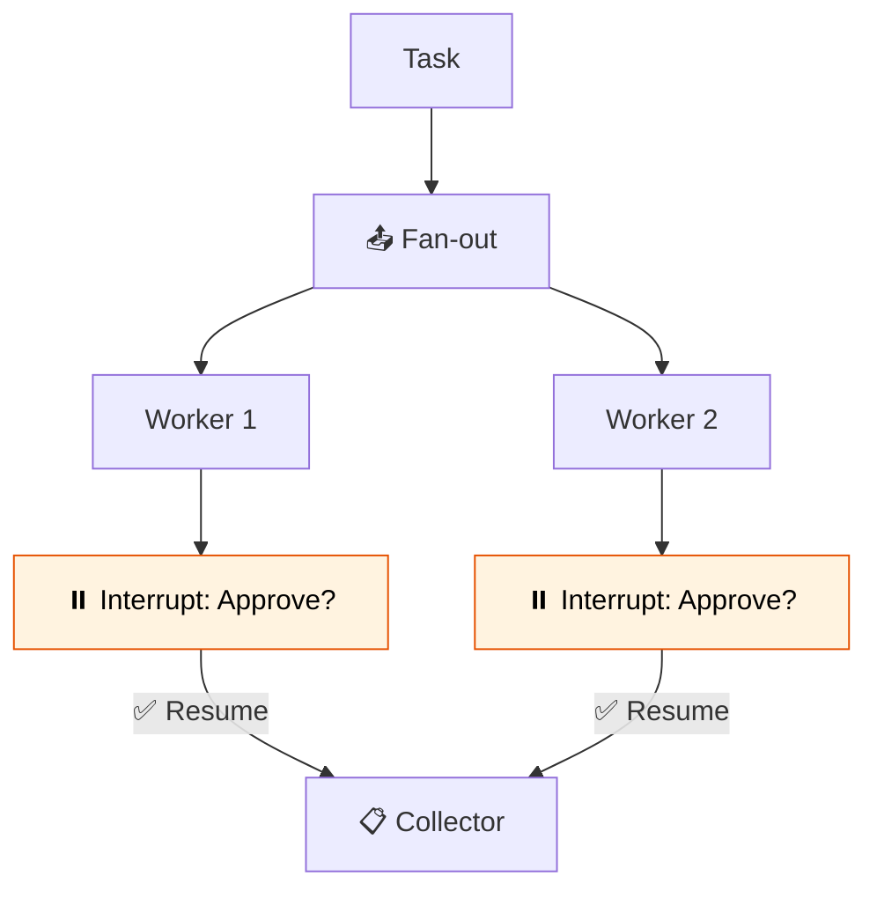

# 43 — Swarm with Human Approval

Multiple workers process items in parallel, but every result requires **human approval** before being accepted.



## Code Walkthrough

```python
def worker(state: dict) -> dict:
    suggestion = llm.invoke(f"Suggest an improvement: {state['item']}")
    interrupt({"item": state["item"], "suggestion": suggestion, "question": "Approve?"})
    return {}

# After interrupt, resume with:
graph.invoke(Command(resume="approved"), config=config)
```

**What each piece does:**
- **`worker`** — Generates a suggestion, then calls `interrupt()`. The graph pauses. The interrupt value (item + suggestion) is surfaced to the caller.
- **`interrupt(value)`** — Pauses the **current worker only**. Other workers continue running. Each interrupt is independent.
- **`dispatcher`** — Uses `Send` to create one worker per item. Each worker gets its own interrupt.
- **`Command(resume="approved")`** — Resumes the graph. The `resume` value is returned by `interrupt()`. Each interrupt must be resumed individually.
- **`get_state(config).tasks`** — Lists all pending interrupt tasks after the graph pauses.

**Data flow:** items → dispatcher fans out → each worker generates suggestion → pauses with interrupt → user approves each → workers resume → collector merges.

## What you'll build

- Parallel workers via `Send`
- Each worker pauses with `interrupt()` for approval
- `Command(resume=...)` to continue
- Collector merges approved results
