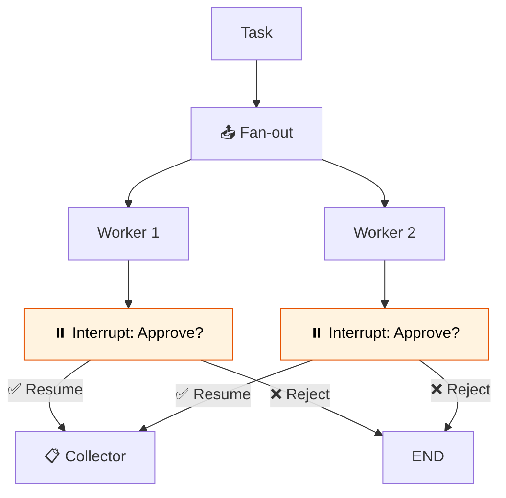

# 43 — Swarm with Human Approval

Multiple workers process items in parallel, but every result requires **human approval** before being accepted. Workers pause at `interrupt()` and wait.

## What you'll build

- Parallel workers via `Send`
- Each worker pauses with `interrupt()` for approval
- `Command(resume=...)` to continue or reject
- Collector merges approved results
