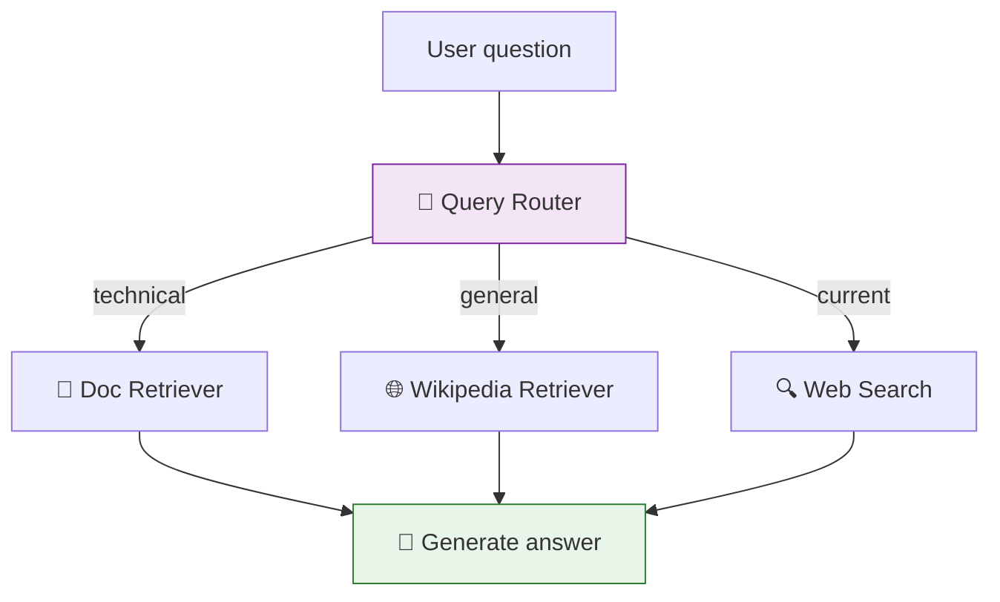

# 44 — RAG Query Router

A router examines a user question and sends it to the **best retriever**: docs, Wikipedia, or web search.

## What you'll build

- LLM-based router that classifies queries
- Multiple retrieval sources (Chroma, Wikipedia, web)
- Conditional edge routing to the right retriever
- Single generation node regardless of source
