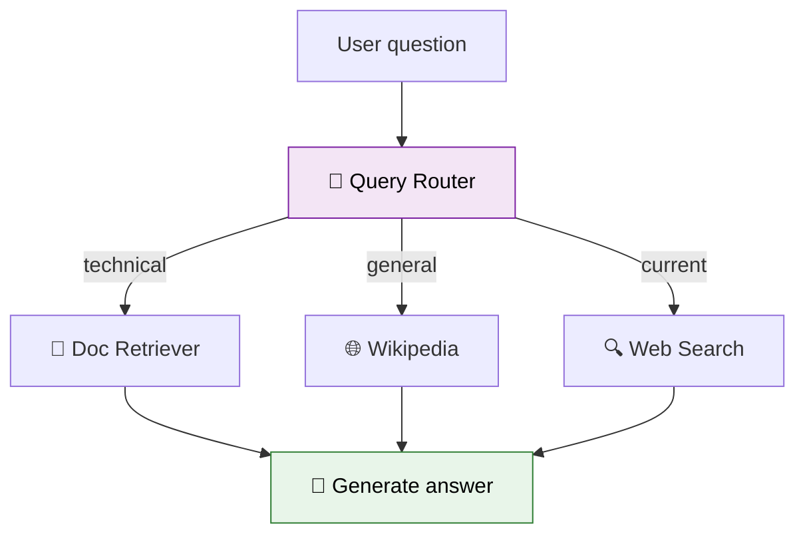

# 44 — RAG Query Router

A router examines a question and sends it to the **best retriever**: docs, Wikipedia, or web search.



## Code Walkthrough

```python
def router(state: State) -> dict:
    prompt = f"Question: {state['question']}\nIs this: 'docs', 'wiki', or 'web'? Reply with just the word."
    source = llm.invoke(prompt).content.strip().lower()
    return {"source": source}

def retrieve_docs(state: State) -> dict:
    results = vectorstore.similarity_search(state["question"])
    return {"context": "\n".join([d.page_content for d in results])}
```

**What each piece does:**
- **`router`** — An LLM classifies the query type. Returns `"docs"`, `"wiki"`, or `"web"` which determines which retriever node runs next.
- **`retrieve_docs`** — Queries a Chroma vector store (pre-loaded with technical docs). Returns document chunks as context.
- **`retrieve_wiki`** — Simulates Wikipedia retrieval via LLM (would use `WikipediaLoader` in production).
- **`retrieve_web`** — Simulates web search via LLM.
- **`generate`** — Same for all sources: takes the retrieved context + original question, and generates an answer using an LCEL chain.
- **Conditional edge** — Routes from `"router"` to one of 3 retriever nodes based on `state["source"]`.

**Data flow:** question → router classifies → one retriever runs → generate answer from context + question.

## What you'll build

- LLM-based router that classifies queries
- Multiple retrieval sources (Chroma, Wikipedia, web)
- Conditional edge routing to the right retriever
- Single generation node regardless of source
