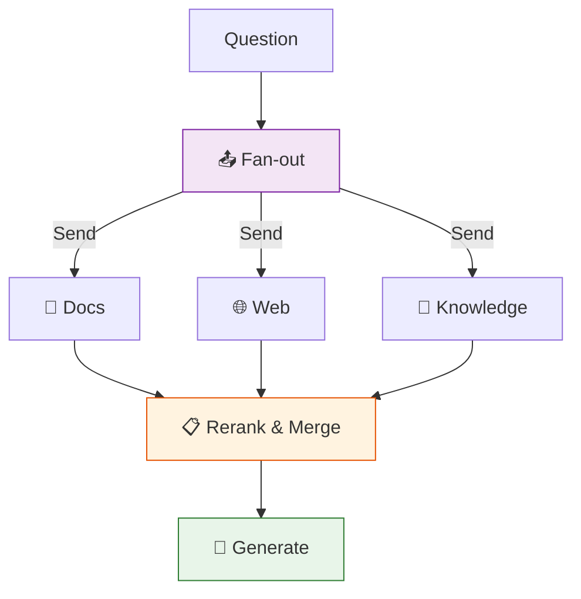

# 45 — Multi-Source RAG

Query **three sources in parallel** — docs, web, and internal knowledge — then **rerank** and generate from the best results.

## What you'll build

- `Send` fans out to 3 retrievers in parallel
- Each retriever returns context from a different source
- Rerank node scores and selects the best context
- Generate node produces final answer
