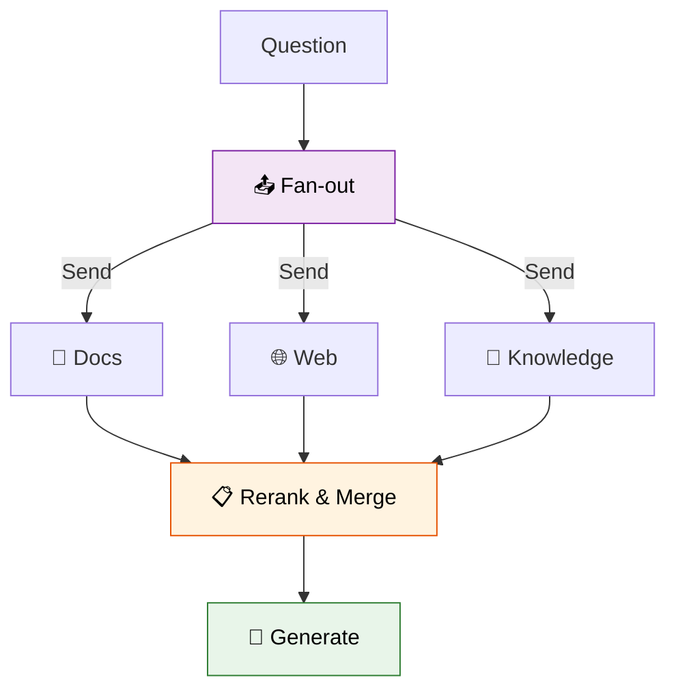

# 45 — Multi-Source RAG

Query **three sources in parallel**, then **rerank** and generate from the best result.



## Code Walkthrough

```python
def route_to_retrievers(state: State) -> list[Send]:
    return [Send("retrieve", {"source": src, "question": state["question"]}) for src in ["docs", "web", "knowledge"]]

def retrieve(state: dict) -> dict:
    result = llm.invoke(prompts[state["source"]])  # different prompt per source
    return {"contexts": [{"source": state["source"], "text": result.content}]}

def rerank(state: State) -> dict:
    best = llm.invoke(f"Which source is most relevant?\n{items}").content.strip()
    # Pick the best source's text
    return {"best_context": best_text}
```

**What each piece does:**
- **`route_to_retrievers`** — Fans out to 3 parallel `"retrieve"` nodes, one per source. Each gets the same question but a different `source` key.
- **`retrieve`** — Uses a **different prompt per source** (`"Answer based on documentation"` vs `"Answer based on web"`). Each returns its result as a `contexts` dict entry.
- **`operator.add` on contexts** — All 3 parallel results merge into `state["contexts"]` automatically.
- **`rerank`** — An LLM reads all 3 candidate answers and picks the best source. Only the best source's text is kept.
- **`generate`** — Produces the final answer from the best context.

**Data flow:** question → 3 parallel retrievers → all contexts merge → rerank picks best → generate final answer.

## What you'll build

- `Send` fans out to 3 retrievers in parallel
- Each retriever returns context from a different source
- Rerank node scores and selects the best context
- Generate node produces final answer
