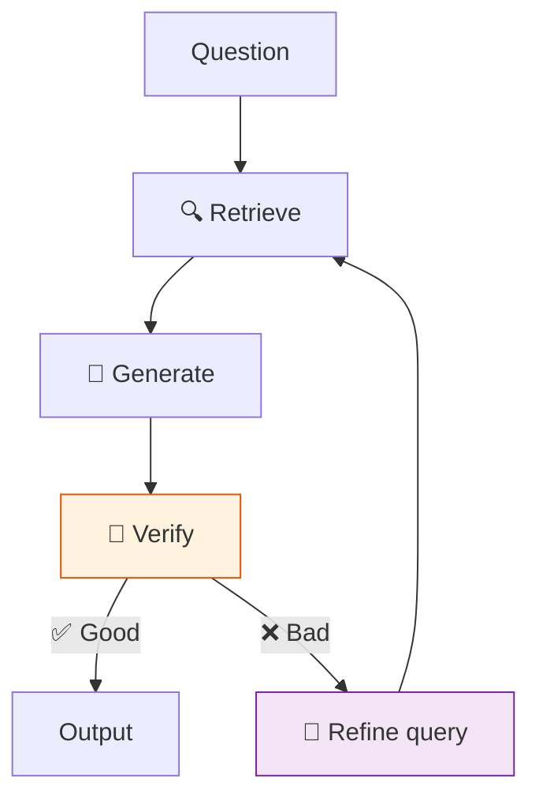

# 46 — Self-Correcting RAG

Retrieve → generate → **verify**. If the answer is bad, re-retrieve with refined query and try again.

## What you'll build

- Retriever node (simulated with LLM)
- Generator node produces answer
- Verifier node scores answer (pass/fail)
- On fail: refine the query and loop back to retrieve
- Max 3 attempts
