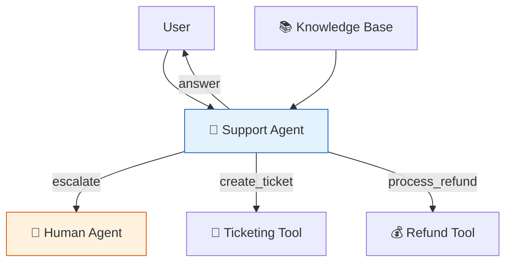

# 47 — Customer Support Bot

A production-ready support bot combining **RAG** (product docs), **memory** (conversation history), **human handoff** (escalation), and **tools** (ticketing, refunds).

## What you'll build

- System prompt with support guidelines
- Knowledge base via simulated RAG
- Tools: `create_ticket`, `process_refund`
- Human escalation via `interrupt()`
- `MemorySaver` for conversation persistence
