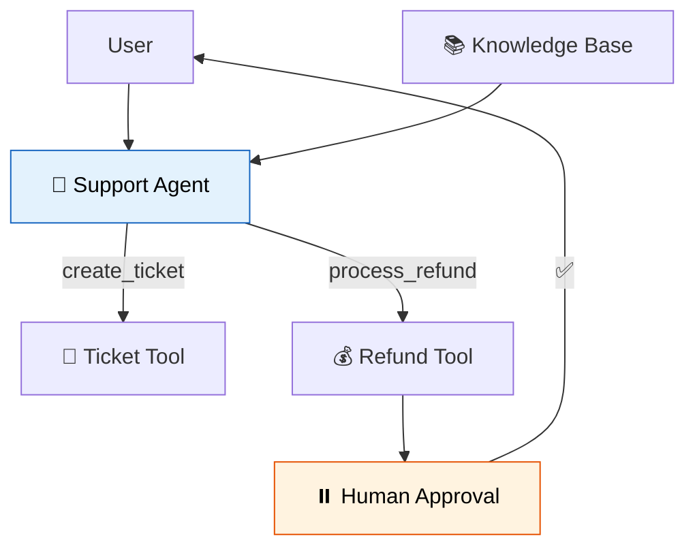

# 47 — Customer Support Bot

A production-ready support bot: **RAG** (knowledge base) + **tools** (tickets, refunds) + **human handoff** (interrupt for approvals) + **memory** (checkpointing).



## Code Walkthrough

```python
@tool
def search_knowledge_base(query: str) -> str:  # RAG tool
    return kb_results.get(query, "Not found.")

@tool
def create_ticket(issue: str, priority: str = "normal") -> str:
    return f"Ticket created: TKT-{hash(issue)}"

@tool
def process_refund(order_id: str, reason: str) -> str:
    interrupt({"type": "refund_approval", "order_id": order_id})  # HITL
    return f"Refund processed for {order_id}."
```

**What each tool does:**
- **`search_knowledge_base`** — Simulated RAG. In production, this would query a vector store. Answers policy questions (returns, shipping, warranty).
- **`create_ticket`** — Creates a support ticket. Simple tool, no approval needed. Returns a ticket reference number.
- **`process_refund`** — Calls `interrupt()` to pause for **human approval**. The refund doesn't execute until a human resumes with `Command(resume="approved")`.
- **`MemorySaver`** — Checkpointer keeps conversation history across turns. The support bot remembers what the user said earlier.
- **System prompt** — Sets behavior: use knowledge base for answers, tickets for issues, refunds require approval.

**Data flow:** user question → agent calls KB tool → answers directly OR agent decides to escalate → creates ticket OR requests refund → refund requires human approval → resume after approval.

## What you'll build

- System prompt with support guidelines
- Knowledge base via simulated RAG
- Tools: `create_ticket`, `process_refund`
- Human escalation via `interrupt()`
- `MemorySaver` for conversation persistence
