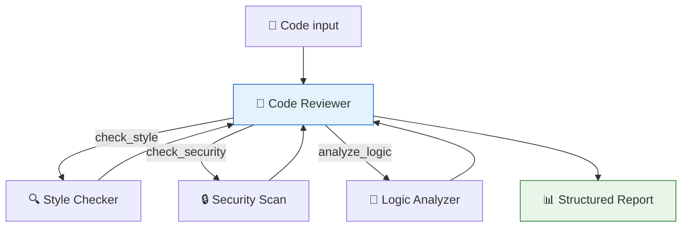

# 48 — Code Review Agent

An agent that **reviews code** — checks for bugs, style issues, and security problems — then produces a **structured report**.

## What you'll build

- Tools for style checking, security scanning, and logic analysis
- Agent that calls tools and collects results
- `with_structured_output` for a typed review report
- Condition: if critical issues found, mark as FAIL
