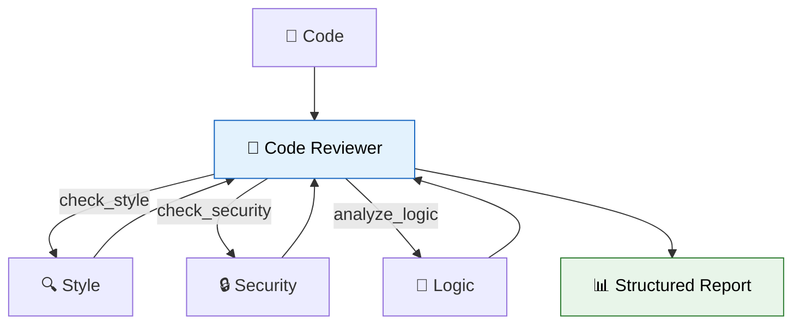

# 48 — Code Review Agent

An agent that **reviews code** — checks style, security, and logic — then produces a **structured report**.



## Code Walkthrough

```python
@tool
def check_style(code: str) -> str:  # Returns style issues found
    issues = []
    if "    " not in code: issues.append("No indentation")
    return "\n".join(issues) if issues else "Style OK."

@tool
def check_security(code: str) -> str:  # Returns security issues
    if "eval(" in code: issues.append("eval() detected")
    return "\n".join(issues) if issues else "Security OK."

class ReviewReport(BaseModel):  # Structured output schema
    score: int = Field(description="Score 1-10")
    bugs: list[str] = Field(description="Bugs found")
    verdict: str = Field(description="PASS/FAIL")

structured_llm = llm.with_structured_output(ReviewReport, method="function_calling")
```

**What each piece does:**
- **`check_style`** — A tool that simulates a style linter. Checks for indentation, length, etc.
- **`check_security`** — A tool that simulates a security scanner. Checks for `eval()`, hardcoded passwords.
- **`analyze_logic`** — A tool that checks for logic issues: TODOs, empty passes, function length.
- **`agent`** — Calls all three tools (via `bind_tools`), collects results, then passes the full conversation to a **structured output** model.
- **`ReviewReport`** — A Pydantic model defining the report schema. `with_structured_output` ensures the final output is a validated `ReviewReport` instance.
- **Conditional edge** — After agent calls tools → `"tools"` node runs them → back to agent. When no more tool calls → `"report"` node generates the structured report.

**Data flow:** code → agent decides which checks to run → tools execute → agent reads results → report node generates structured `ReviewReport`.

## What you'll build

- Tools for style checking, security scanning, and logic analysis
- Agent that calls tools and collects results
- `with_structured_output` for a typed review report
- Condition: if critical issues found, mark as FAIL
