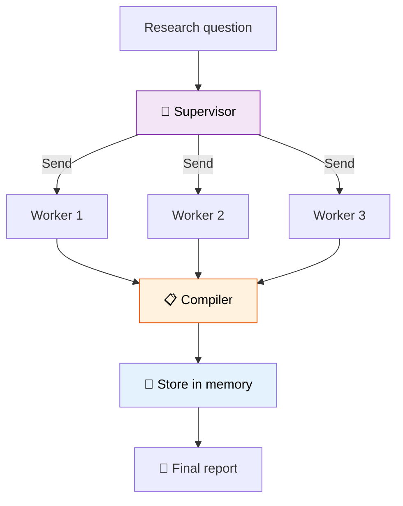

# 49 — Research Assistant

A **supervisor** delegates to 3 specialist workers, then compiles a final report with **long-term memory**.



## Code Walkthrough

```python
def supervisor(state: ResearchState) -> dict:
    topics = llm.invoke(f"Research topic: {state['question']}\nWhat 3 aspects? One per line.")
    return {"topics": [t.strip() for t in topics.content.strip().split("\n") if t.strip()][:3]}

def router(state: ResearchState) -> list[Send]:
    return [Send("worker", {"aspect": a, "question": state["question"]}) for a in state["topics"]]

def worker(state: dict) -> dict:
    response = llm.invoke(f"Research '{state['aspect']}' of '{state['question']}'. 2-3 sentences.")
    return {"sections": [f"## {state['aspect']}\n{response.content.strip()}"]}

def compiler(state: ResearchState) -> dict:
    report = f"# Research: {state['question']}\n\n" + "\n\n".join(state["sections"])
    store.put(("research", state["question"][:20]), "report", {"report": report})
    return {"report": report}
```

**What each node does:**
- **`supervisor`** — Asks the LLM to break the research question into 3 aspects. Stores them in `state["topics"]`.
- **`router`** — Creates one `Send` per aspect. Each worker researches one aspect in **parallel**.
- **`worker`** — Writes 2-3 sentences about one aspect. Returns a markdown section.
- **`compiler`** — Joins all sections into a full report. **Saves** it to `InMemoryStore` under the `("research", ...)` namespace for future retrieval.
- **Long-term memory** — Reports are stored with `store.put()`. On future queries, `store.search()` can find past research on similar topics.

**Data flow:** question → supervisor splits into aspects → router fans out → workers research in parallel → sections merge → compiler saves to store + returns report.

## What you'll build

- Supervisor routes to specialist workers
- Workers each produce a section
- Compiler merges sections into a report
- Report saved to `InMemoryStore` for future retrieval
- Support for follow-up questions referencing past research
