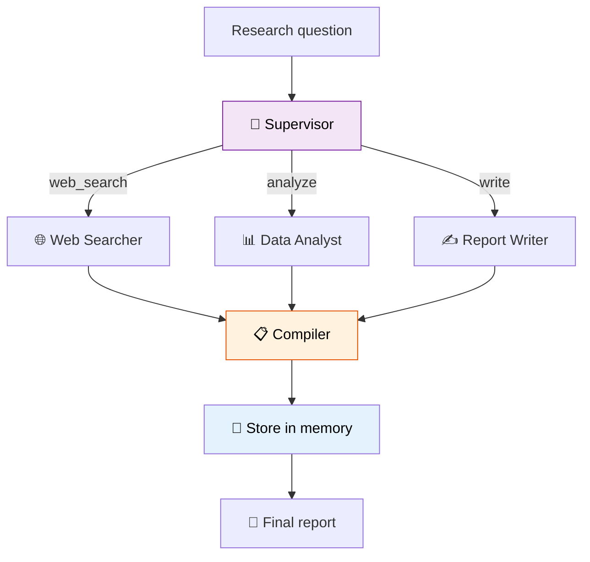

# 49 — Research Assistant

A **supervisor** agent delegates to 3 specialist workers (Web Search, Data Analysis, Report Writing), then compiles a final research report with **long-term memory**.

## What you'll build

- Supervisor routes to specialist workers
- Workers each produce a section
- Compiler merges sections into a report
- Report saved to `InMemoryStore` for future retrieval
- Support for follow-up questions referencing past research
