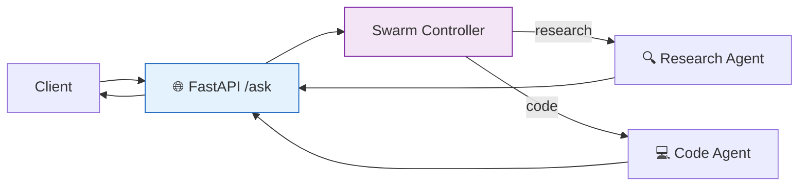

# 50 — Agent API Server

Deploy a **multi-agent swarm** behind a **FastAPI** server with streaming, checkpointing, and Docker support.

## What you'll build

- FastAPI server with `/ask` endpoint
- Swarm of specialist agents routed by query type
- Streaming responses with SSE
- `MemorySaver` for session persistence
- Dockerfile for deployment
