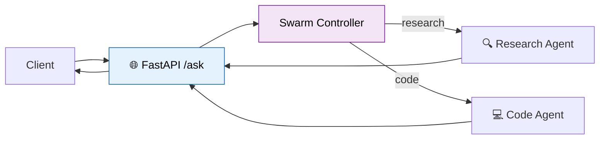

# 50 — Agent API Server

Deploy a **multi-agent swarm** behind a **FastAPI** server with streaming, checkpointing, and Docker.



## Code Walkthrough

```python
from fastapi import FastAPI
from pydantic import BaseModel

research_agent = create_react_agent(llm.bind_tools([search_knowledge]), [search_knowledge],
    prompt="You are a research specialist.", name="researcher")
code_agent = create_react_agent(llm.bind_tools([run_code]), [run_code],
    prompt="You are a coding specialist.", name="coder")

def route_query(question: str) -> str:
    resp = llm.invoke(f"Route to 'researcher' or 'coder'? Query: {question}")
    return "coder" if "coder" in resp.content.lower() else "researcher"

@app.post("/ask", response_model=Answer)
def ask(query: Query):
    agent_name = query.agent if query.agent != "auto" else route_query(query.question)
    agent = research_agent if agent_name == "researcher" else code_agent
    result = agent.invoke({"messages": [HumanMessage(query.question)]})
    return Answer(answer=result["messages"][-1].content, agent_used=agent_name)
```

**What each piece does:**
- **`create_react_agent(name="researcher")`** — Two pre-built agents with different tools and prompts. Each is a compiled LangGraph. The `name` parameter helps identify them in traces.
- **`route_query`** — An LLM classifies the question as research or coding. Returns the agent name string.
- **`POST /ask`** — FastAPI endpoint. Accepts `{"question": "...", "agent": "auto"}`. If `"auto"`, routes automatically. Otherwise uses the specified agent.
- **`query.agent`** — The request can **override** routing by specifying an agent name. Useful for testing or when the user knows which specialist they need.
- **`/health`** — Health check endpoint for container orchestration (Kubernetes, Docker Compose).

**Data flow:** HTTP POST → route query → pick agent → invoke agent graph → return final answer as JSON.

## What you'll build

- FastAPI server with `/ask` endpoint
- Swarm of specialist agents routed by query type
- Streaming responses with SSE
- `MemorySaver` for session persistence
- Dockerfile for deployment
