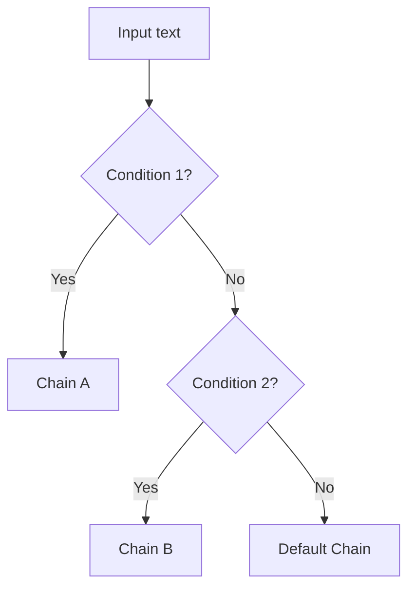

# 51 — RunnableBranch

## What is RunnableBranch?

`RunnableBranch` routes input to **different chains** based on conditions. It's like an if/elif/else for LCEL.



## Code Walkthrough

```python
from langchain_core.runnables import RunnableBranch

positive_chain = prompt_positive | llm | parser
negative_chain = prompt_negative | llm | parser
default_chain  = prompt_default  | llm | parser

branch = RunnableBranch(
    (lambda x: "great" in x.lower(), positive_chain),
    (lambda x: "bad" in x.lower(),   negative_chain),
    default_chain,
)
```

**What each piece does:**
- **`RunnableBranch((condition, chain), (condition, chain), default)`** — Takes pairs of `(predicate_function, runnable)` plus a default. For each input, predicates are evaluated **in order**. The first `True` predicate's chain runs. If none match, the default runs.
- **Predicate function** — A callable `(input) -> bool`. Each predicate receives the full input. Can check any condition.
- **Each chain** — A full LCEL chain `prompt | llm | parser`. The matching chain receives the **same input** as the branch.
- **Default chain** — Always provided as the last argument. Runs if no predicate matches.

## What you'll build

- Branching logic in LCEL without if/else
- Multiple prompt templates for different scenarios
- A default fallback chain
