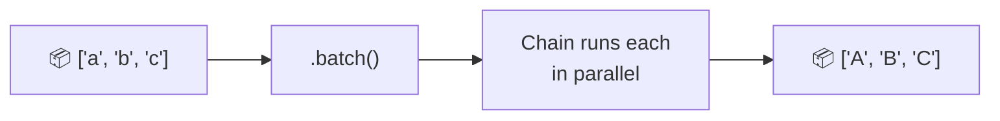

# 52 — Batch Processing with `.batch()`

## What is `.batch()`?

Every LCEL chain has a `.batch()` method that runs a list of inputs **in parallel**. It's the simplest way to process multiple items — no special wrappers needed.



## Code Walkthrough

```python
chain = prompt | llm | parser
results = chain.batch([{"input": w} for w in words])
```

**What each piece does:**
- **`.batch([input1, input2, ...])`** — Takes a **list of inputs**. Each input is processed independently. Returns a list of outputs in the same order.
- **Parallel execution** — `.batch()` uses a thread pool to run inputs concurrently. The number of concurrent workers is configurable via `config={"max_concurrency": 5}`.
- **Error isolation** — One failing input doesn't affect others (errors are returned as exceptions in the result list).
- **No special wrapper** — Unlike `RunnableEach` (removed in recent versions), `.batch()` is built into every Runnable by default.

## What you'll build

- Batch translation of multiple words
- Batch sentiment classification
- Parallel processing without extra setup
