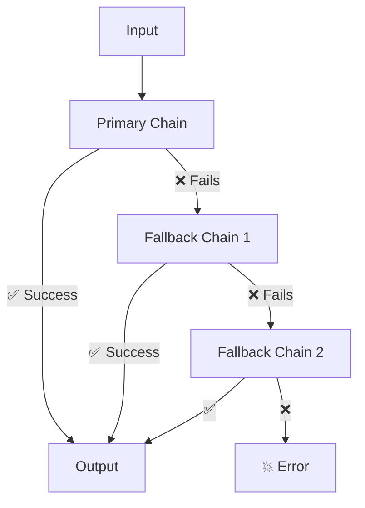

# 53 — with_fallbacks & with_retry

## What are fallbacks and retries?

- **`.with_fallbacks()`** — If the primary chain fails (API error, bad output), switch to a backup chain.
- **`.with_retry()`** — If the chain fails, retry automatically with backoff.



## Code Walkthrough

```python
chain = primary_chain.with_fallbacks([backup_chain, final_backup])
chain = primary_chain.with_retry(stop_after_attempt=3)
```

**What each piece does:**
- **`.with_fallbacks([chain1, chain2])`** — Returns a new runnable that tries the primary chain first. If it raises an exception, tries `chain1`. If that also fails, tries `chain2`. Only raises if ALL chains fail.
- **`.with_retry(stop_after_attempt=3)`** — Returns a new runnable that retries the chain up to 3 times on failure. Uses exponential backoff between attempts.
- **Chain combination** — You can combine both: `.with_retry().with_fallbacks([...])`. Retry first, then fallback.
- **`RunnableRetry`** — The class underlying `.with_retry()`. Configurable with `stop_after_attempt`, `wait_exponential_jitter`, etc.

## What you'll build

- Primary + fallback chains (different prompts/models)
- Retry logic with automatic backoff
- Graceful degradation on API errors
