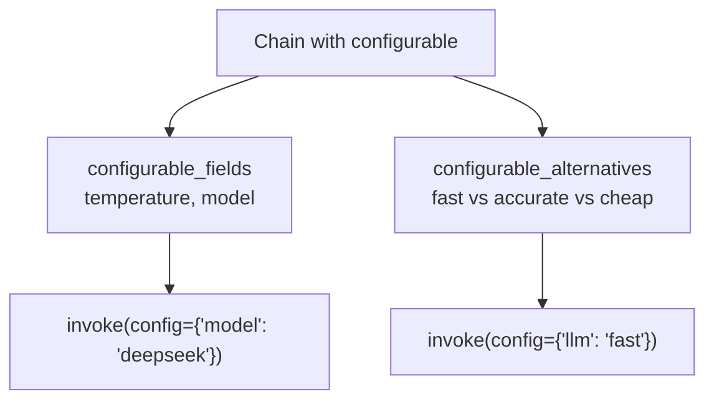

# 54 — Configurable Runnables

## What are configurable runnables?

`.configurable_fields()` and `.configurable_alternatives()` let you **swap parameters or entire components** at runtime without rewriting your chain.



## Code Walkthrough

```python
chain = prompt | llm | parser
chain = chain.configurable_fields(
    temperature=ConfigurableField(id="temp", name="Temperature")
)
result = chain.invoke(input, config={"configurable": {"temp": 0.7}})
```

**What each piece does:**
- **`ConfigurableField(id="...")`** — Declares a field as configurable. The `id` is used to reference it at invocation time.
- **`configurable_fields(temp=ConfigurableField(id="temp"))`** — Makes the `temperature` parameter of the LLM overridable at runtime. Returns a new runnable.
- **`configurable_alternatives(which=ConfigurableField(id="llm"), fast=fast_chain, accurate=accurate_chain)`** — Swaps entire chain components based on a config key. The `default_key` is used when no config is provided.
- **`invoke(input, config={"configurable": {"temp": 0.7, "llm": "fast"}})`** — Passes config values at invocation. The chain reads `temp` and sets the LLM temperature, or switches to the `fast` alternative.

## What you'll build

- Runtime temperature control
- Swappable models/prompts without rewriting chains
- Multi-config chains for A/B testing
