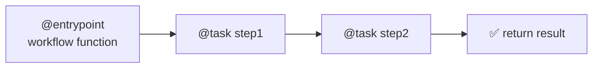

# 55 — LangGraph Functional API

## What is the Functional API?

The **Functional API** (`@entrypoint` + `@task`) lets you write LangGraph workflows using **decorators** instead of explicitly building `StateGraph`. Your function becomes the graph — each `@task` is a checkpointable step.



## Code Walkthrough

```python
from langgraph.func import entrypoint, task

@task
def fetch_data(query: str) -> str:
    return llm.invoke(f"Research: {query}").content

@task
def analyze(data: str) -> str:
    return llm.invoke(f"Analyze: {data}").content

@entrypoint(checkpointer=MemorySaver())
def research_workflow(topic: str) -> dict:
    data = fetch_data(topic).result()
    analysis = analyze(data).result()
    return {"data": data, "analysis": analysis}
```

**What each decorator does:**
- **`@task`** — Marks a function as a checkpointable step. Each task runs inside its own graph node. The function can be `async def`. Call it normally — it returns a `SyncAsyncFuture`; call `.result()` to get the actual value.
- **`@entrypoint(checkpointer=MemorySaver())`** — Marks the main workflow function. It becomes a compiled graph automatically. Supports `checkpointer`, `store`, `cache`. The function can use `for` loops, `if` statements, and normal Python control flow — tasks are executed inside the graph engine.
- **`.result()`** — On a task's return value, blocks until the task completes and returns the actual result. Tasks can run in parallel if you don't call `.result()` immediately.
- **`entrypoint.final(value, save=schema)`** — Decouples the return value from what's saved in checkpoints. Use when the return value is too large to persist.

## What you'll build

- Workflow as decorated Python functions
- Checkpointable task steps
- Parallel execution with `.result()`
- Persistent workflows with `MemorySaver`
