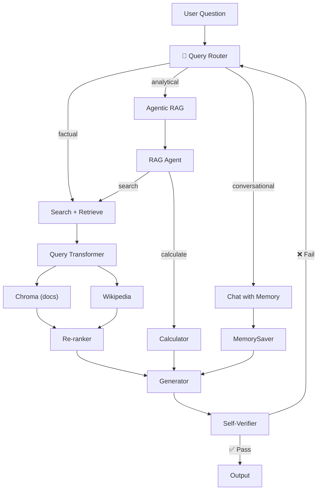

# 56 — Production-Grade Advanced RAG

## What this builds

A single, production-ready RAG system combining **6 patterns**: Query Routing, Query Transformation (HyDE), Multi-Source Retrieval + Re-ranking, Agentic RAG, Self-Verification, and Persistent Memory.

## Architecture



## Code Walkthrough

### Query Router
```python
def route_question(state: State) -> str:
    response = llm.invoke(f"Classify: 'conversational', 'factual', or 'analytical'?\n{state['question']}")
    return response.content.strip().lower()
```
**What it does:** An LLM classifies each query into 3 types. Uses `add_conditional_edges` to route to different handlers.

### Query Transformer (HyDE)
```python
def transform(state: State) -> dict:
    hypothetical = llm.invoke(f"Generate a hypothetical answer to: {state['question']}")
    return {"enhanced_query": f"{state['question']}\n{hypothetical.content}"}
```
**What it does:** Generates a **hypothetical document** that would answer the question, then appends it to the query. This improves retrieval by bridging the query-document vocabulary gap.

### Multi-Source Retrieval + Re-ranking
```python
def retrieve_all(state: State) -> list[Send]:
    return [Send("retriever", {"source": s, "query": state["enhanced_query"]}) for s in ["chroma", "wiki"]]

def rerank(state: State) -> dict:
    pairs = [(d.page_content, state["question"]) for d in state["documents"]]
    scores = cross_encoder.predict(pairs)
    ranked = [d for _, d in sorted(zip(scores, state["documents"]), reverse=True)][:3]
    return {"documents": ranked}
```
**What it does:** Fans out to Chroma + Wikipedia in parallel. After collecting results, a cross-encoder re-ranker scores each document against the question and keeps only the top 3.

### Agentic RAG
```python
@tool
def search_docs(query: str) -> str:
    """Search documentation. Used for factual queries."""
    return vectorstore.similarity_search(query)

@tool
def calculate(expression: str) -> str:
    """Calculate mathematical expressions."""
    return eval(expression)

agent = create_react_agent(llm.bind_tools([search_docs, calculate]), [search_docs, calculate])
```
**What it does:** A LangGraph agent that DECIDES when to search or calculate. The agent controls retrieval — it searches only when needed.

### Self-Verification
```python
def verify(state: State) -> dict:
    score = llm.with_structured_output(VerificationScore).invoke(
        f"Question: {state['question']}\nAnswer: {state['answer']}\nScore correctness 0-1.")
    return {"verification_score": score.score, "attempts": state["attempts"] + 1}
```
**What it does:** An LLM judges the answer's correctness. If score < threshold and attempts < 3, the graph loops back to re-retrieve with a refined query.

### Cross-cutting: Memory, Caching, Streaming
- **MemorySaver** — Full conversation history across turns
- **InMemoryCache** — Cache identical queries to save API calls
- **Streaming** — `.stream(mode="messages")` for token-by-token output
- **RetryPolicy** — Retry on API failures
