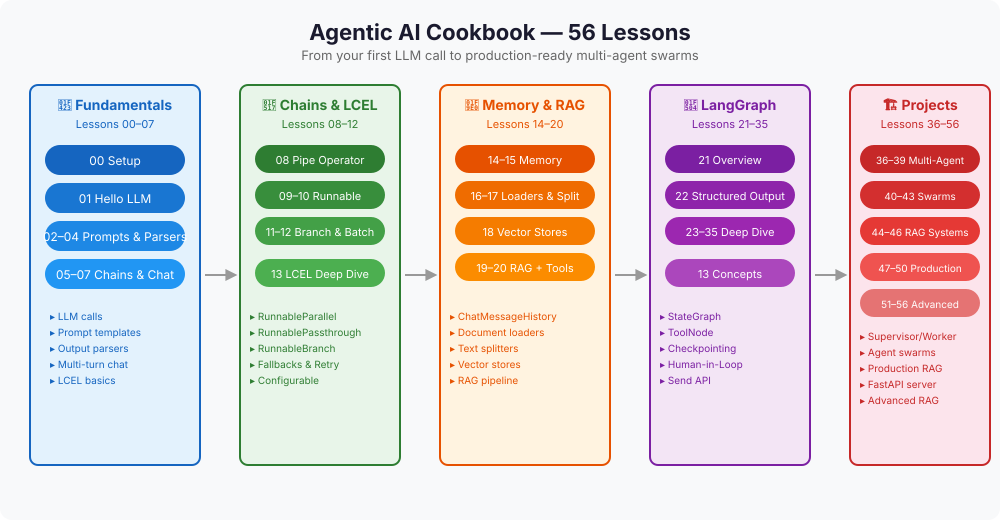
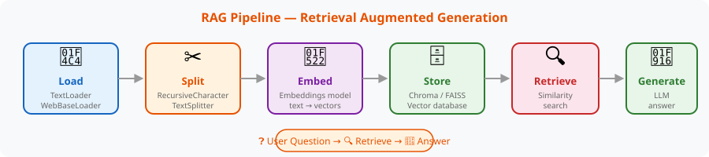
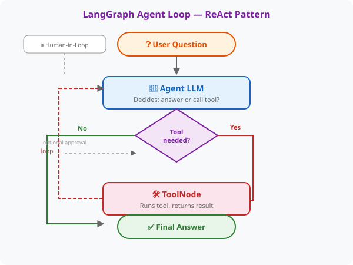
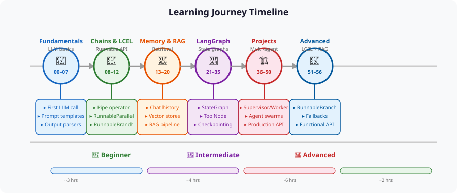

# Agentic AI Cookbook

A step-by-step journey through LangChain + LangGraph — from your first LLM call to production-ready multi-agent swarms. **56 lessons** covering LLM basics, RAG, agents, tool calling, state graphs, checkpointing, human-in-the-loop, and deployment.



---

## 🚀 Quick Start

```bash
# 1. Verify Python ≥ 3.10
python3 --version

# 2. Create virtual environment
python3 -m venv .venv
source .venv/bin/activate          # Linux/macOS
# .venv\Scripts\activate           # Windows

# 3. Install dependencies
pip install --upgrade pip
pip install -r requirements.txt

# 4. Set up your DeepSeek API key
cp .env.example .env
# Edit .env — replace sk-your-key-here with your real key

# 5. Verify everything works
python 00_setup/main.py
```

> **Note:** Lesson 07's JSONLoader needs `pip install jq` (optional). Chroma-based lessons need sqlite3 ≥ 3.35; if your system lacks it, `pysqlite3-binary` (already in requirements.txt) handles it.

---

## 📚 Curriculum

### 🐣 Phase 1: Fundamentals — Lessons 00–07

| # | Lesson | What you'll learn |
|---|--------|-------------------|
| 00 | **Setup** | Verify environment, first DeepSeek call |
| 01 | **Hello LLM** | `.invoke()`, basic completion, prompt templates |
| 02 | **Prompt Templates** | `ChatPromptTemplate`, variables, few-shot |
| 03 | **Output Parsers** | `StrOutputParser`, `PydanticOutputParser`, `CommaSeparatedListOutputParser` |
| 04 | **Chat Models** | System/Human/AI messages, multi-turn chat |
| 05 | **Chains** | LCEL pipe `\|`, `RunnablePassthrough`, `.assign()` |
| 06 | **Memory** | `ChatMessageHistory`, `RunnableWithMessageHistory`, session IDs |
| 07 | **Document Loaders** | `TextLoader`, `CSVLoader`, `WebBaseLoader`, `JSONLoader` |

### 🔗 Phase 2: Chains & LCEL — Lessons 08–12

| # | Lesson | What you'll learn |
|---|--------|-------------------|
| 08 | **Text Splitters** | `RecursiveCharacterTextSplitter`, `MarkdownHeaderTextSplitter` |
| 09 | **Vector Stores** | Chroma, FAISS, similarity search, `FakeEmbeddings` |
| 10 | **RAG** | Full Load → Split → Embed → Store → Retrieve → Generate pipeline |
| 11 | **Advanced Retrieval** | `MultiQueryRetriever`, `SelfQueryRetriever` |
| 12 | **Agents** | `@tool`, `create_react_agent`, LangGraph agents |

### 🧠 Phase 3: Memory, RAG & Tools — Lessons 13–20

| # | Lesson | What you'll learn |
|---|--------|-------------------|
| 13 | **LCEL Deep Dive** | `RunnableParallel`, `RunnableLambda`, `RunnablePick`, `@chain`, `.assign()` |
| 14 | **Callbacks & Streaming** | `BaseCallbackHandler`, token-by-token streaming |
| 15 | **Evaluation** | Criteria evaluation, labeled scoring |
| 16 | **Caching** | `InMemoryCache`, `SQLiteCache` |
| 17 | **Streaming & Async** | `.astream()`, `.ainvoke()`, `asyncio.gather()` |
| 18 | **Deployment** | FastAPI, `uvicorn`, Docker |
| 19 | **Gradio UI** | `gr.ChatInterface`, streaming, RAG UI |
| 20 | **Tool Calling** | `@tool`, `bind_tools()`, tool calling loop |



### 🔄 Phase 4: LangGraph Deep Dive — Lessons 21–35

| # | Lesson | What you'll learn |
|---|--------|-------------------|
| 21 | **LangGraph Quickstart** | `create_react_agent`, `StateGraph` overview |
| 22 | **Structured Output** | `.with_structured_output()`, Pydantic, `method="function_calling"` |
| 23 | **StateGraph Basics** | `add_node`, `add_edge`, `compile`, `invoke` |
| 24 | **MessagesState** | `add_messages` reducer, chat state |
| 25 | **Conditional Edges** | `add_conditional_edges`, router functions |
| 26 | **ToolNode** | `ToolNode(tools)`, `tools_condition`, ReAct loop |
| 27 | **Checkpointing** | `MemorySaver`, `thread_id`, `get_state()`, `update_state()` |
| 28 | **Human-in-Loop** | `interrupt()`, `Command(resume=...)` |
| 29 | **Send API** | `Send(node, arg)`, parallel fan-out |
| 30 | **Long-Term Memory** | `InMemoryStore`, `BaseStore`, `put()`, `search()` |
| 31 | **Streaming** | `stream()` 4 modes: values, updates, messages, debug |
| 32 | **Error Handling** | `RetryPolicy`, `recursion_limit` |
| 33 | **Subgraphs** | Nested `StateGraph` composition |
| 34 | **Graph Visualization** | `get_graph().draw_mermaid()` |
| 35 | **Command** | `Command(goto=...)`, multi-action returns |



### 🏗️ Phase 5: Projects — Lessons 36–56

| # | Lesson | What you'll build |
|---|--------|-------------------|
| 36 | **Supervisor/Worker** | Boss delegates to parallel workers via `Send` |
| 37 | **Debate Agents** | Pro vs Con agents, Judge declares winner |
| 38 | **Agent Router Team** | Router → specialist agents (coder, writer, analyst) |
| 39 | **Generator + Verifier** | Quality loop: generate → verify → retry on fail |
| 40 | **Map-Reduce Swarm** | `Send` fan-out N workers, `operator.add` collector |
| 41 | **Dynamic Tool Swarm** | LLM decides tool count → `Send` per tool call |
| 42 | **Nested Agent Teams** | Child agent as subgraph inside parent |
| 43 | **Swarm with Approval** | Workers pause at `interrupt()` for human OK |
| 44 | **RAG Query Router** | Route questions to Docs / Wiki / Web |
| 45 | **Multi-Source RAG** | 3 sources in parallel, rerank best result |
| 46 | **Self-Correcting RAG** | Retrieve → generate → verify → re-retrieve if bad |
| 47 | **Customer Support Bot** | RAG + tickets + refunds + human handoff |
| 48 | **Code Review Agent** | Style + security + logic → structured report |
| 49 | **Research Assistant** | Supervisor + 3 workers + long-term memory |
| 50 | **Agent API Server** | FastAPI + swarm + checkpointing + streaming |
| 51 | **RunnableBranch** | Conditional chains with `RunnableBranch` |
| 52 | **Batch Processing** | `.batch()` for parallel input lists |
| 53 | **Fallbacks & Retry** | `.with_fallbacks()`, `.with_retry()`, `RunnableLambda` |
| 54 | **Configurable Runnables** | `.configurable_fields()`, `.configurable_alternatives()` |
| 55 | **Functional API** | `@entrypoint`, `@task` — decorator-based workflows |
| 56 | **Advanced RAG** | Router + HyDE + re-rank + self-verify + agentic RAG |

---

## 🎯 Learning Path



## 🛠️ How to Run a Lesson

```bash
source .venv/bin/activate
python 01_hello_llm/main.py       # any lesson
python 19_gradio/main.py          # Gradio UI (port 7860)
```

Each lesson is self-contained. `README.md` explains the concepts, `main.py` has the runnable code.

## 🐛 Troubleshooting

| Problem | Solution |
|---------|----------|
| `sqlite3 >= 3.35.0 required` | `pip install pysqlite3-binary` (already in requirements.txt) |
| `ModuleNotFoundError: langchain_classic` | `pip install langchain-classic` |
| Chroma fails to import | Ensure pysqlite3-binary is installed, or run `export LD_PRELOAD=$(python -c "import pysqlite3; print(pysqlite3.__file__)")` |
| `jq` package not found | `pip install jq` (lesson 07 JSONLoader only) |
| API key errors | Ensure `.env` has `OPENAI_API_KEY=sk-...` (your DeepSeek key) |
| Gradio not starting | Use `python gradio_chat.py` from repo root |

---

## 📦 Repository Structure

```
├── 00_setup/ → 56_*_project/     # 56 self-contained lessons
├── .venv/                         # Python virtual environment
├── .env                           # Your API key (gitignored)
├── docs/images/                   # SVG diagrams for README
├── scripts/                       # Local start/stop helpers (gitignored)
├── AGENTS.md                      # Instruction file for AI coding agents
├── requirements.txt               # All dependencies
└── .python-version                # Python 3.12
```

## 📄 License

MIT — free to use, modify, and share.
