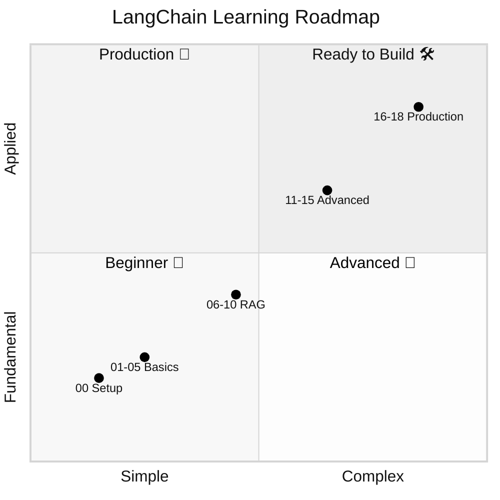
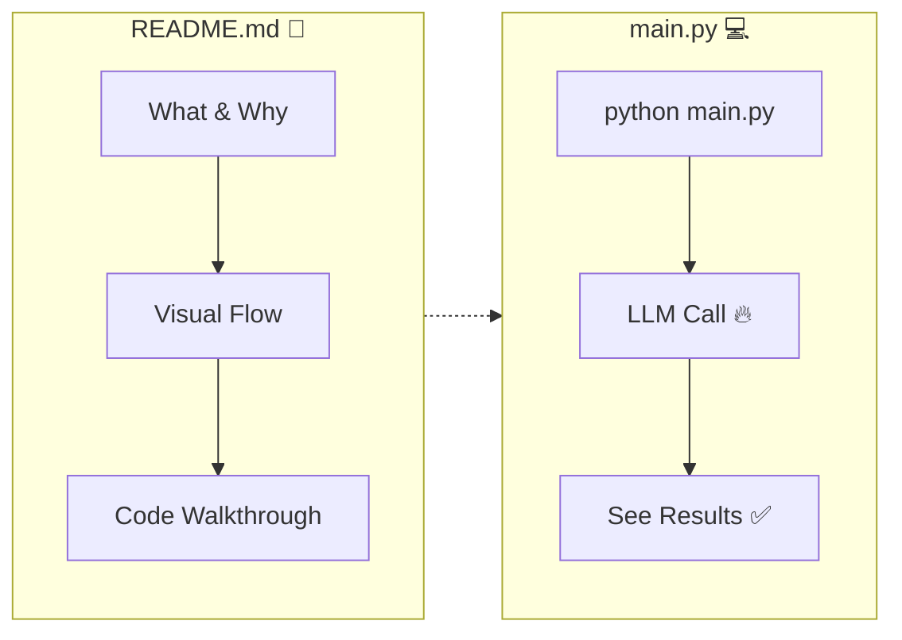
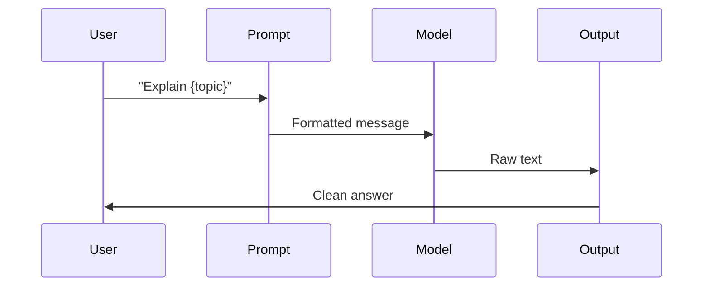
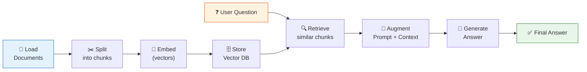
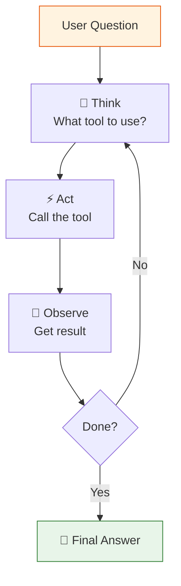

# LangChain Learning Repository

A step-by-step journey through LangChain — from your first LLM call to production-ready deployments.


## Phases



## Prerequisites

- Python 3.12 (3.11 works too)
- A [DeepSeek API key](https://platform.deepseek.com) (free to sign up)

## Quick Start

```bash
python3.12 -m venv .venv
source .venv/bin/activate
pip install -r requirements.txt
cp .env.example .env   # add your OPENAI_API_KEY
```

## How a lesson works

Each lesson shows you the concept and the code side by side:



## Lessons

### 🌱 Beginner — Basics

| # | Lesson | What you build | Core concept |
|---|--------|---------------|--------------|
| 00 | **Setup** | Environment test | `ChatOpenAI` to DeepSeek |
| 01 | **Hello LLM** | First LLM call | `.invoke()`, prompt templates, chains |
| 02 | **Prompt Templates** | Reusable prompts | Variables, roles, few-shot |
| 03 | **Output Parsers** | Structured output | `StrOutputParser`, `PydanticOutputParser` |
| 04 | **Chat Models** | Multi-turn chat | System/human/AI messages |
| 05 | **Chains** | Pipeline steps | `LLMChain`, `SequentialChain` |

**Data flow in a chain:**



### 🔍 Intermediate — RAG & Memory

| # | Lesson | What you build | Core concept |
|---|--------|---------------|--------------|
| 06 | **Memory** | Chat with recall | `BufferMemory`, `SummaryMemory` |
| 07 | **Document Loaders** | Ingest data | `TextLoader`, `CSVLoader`, `WebBaseLoader` |
| 08 | **Text Splitters** | Chunk documents | `RecursiveCharacterTextSplitter` |
| 09 | **Vector Stores** | Semantic search | Chroma, FAISS, embeddings |
| 10 | **RAG** | Ask your documents | Full retrieval pipeline |

**RAG pipeline:**



### 🧠 Advanced — Agents & LCEL

| # | Lesson | What you build | Core concept |
|---|--------|---------------|--------------|
| 11 | **Advanced Retrieval** | Smarter search | `MultiQuery`, `SelfQuery` |
| 12 | **Agents** | AI with tools | ReAct loop, tool calling |
| 13 | **LCEL** | Composable chains | `|` operator, `RunnableParallel` |
| 14 | **Callbacks & Streaming** | Live output | Token streaming, custom handlers |
| 15 | **Evaluation** | Test quality | Criteria evaluation |

**Agent loop:**



### 🚢 Production — Ship It

| # | Lesson | What you build | Core concept |
|---|--------|---------------|--------------|
| 16 | **Caching** | Save money | InMemory, SQLite cache |
| 17 | **Streaming & Async** | Real-time | `async`, `astream`, `asyncio.gather` |
| 18 | **Deployment** | REST API | FastAPI, Docker, uvicorn |
| 19 | **Gradio UI** | Web interfaces | `gr.ChatInterface`, streaming, RAG UI |

### 🎨 Bonus

| File | What it does |
|------|-------------|
| `chat.py` | Terminal chatbot (no UI needed) |
| `gradio_chat.py` | One-file Gradio web chatbot |

## Running a lesson

```bash
source .venv/bin/activate
python 01_hello_llm/main.py
```

Every lesson is self-contained. The `README.md` in each folder explains the concepts, and `main.py` is ready to run.

## Running the Gradio apps

```bash
# Quick chat (one file, no lesson):
python gradio_chat.py

# Full 3-tab Gradio lesson:
python 19_gradio/main.py
```

Then open `http://localhost:7860` in your browser.
