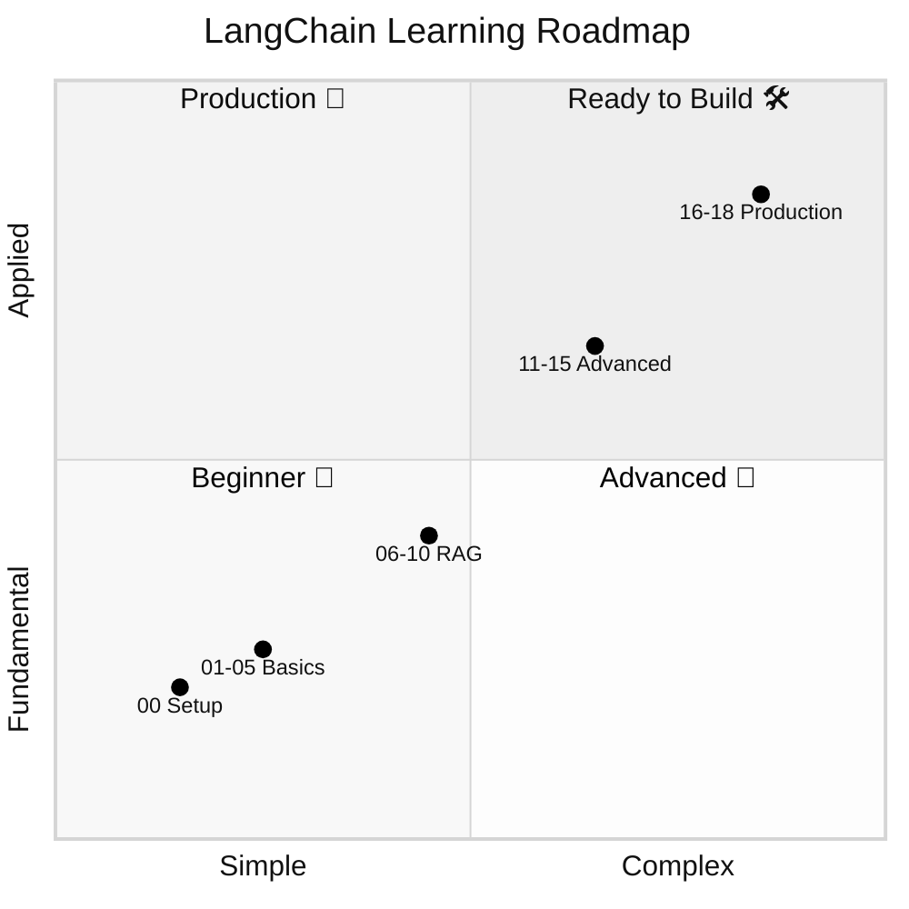
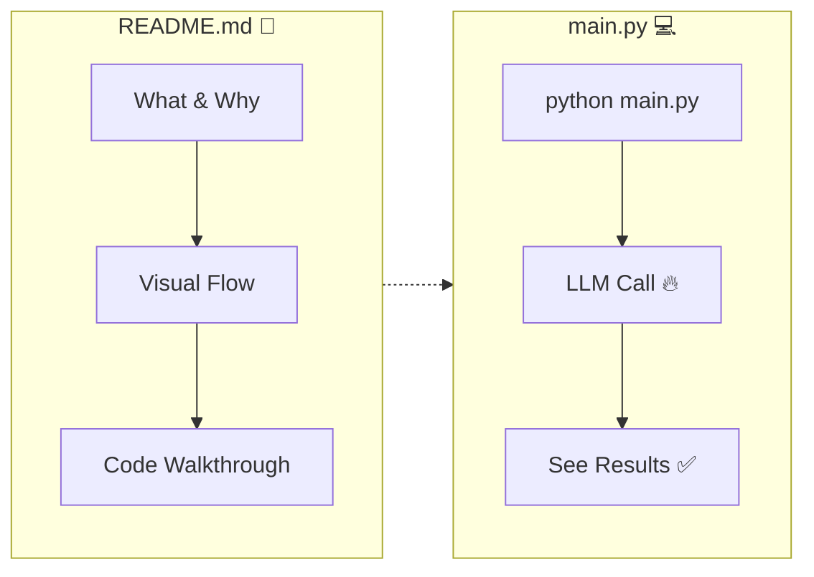
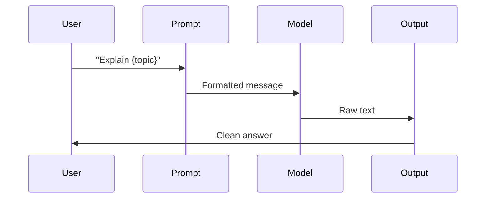
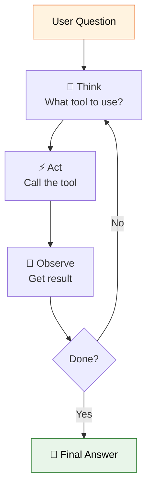

# Agentic AI Cookbook

A step-by-step journey through LangChain + LangGraph — from your first LLM call to production-ready multi-agent swarms. 50 lessons covering LLM basics, RAG, agents, tool calling, state graphs, checkpointing, human-in-the-loop, and deployment.


## Phases



## Prerequisites

- Python 3.12 (3.11 works too)
- A [DeepSeek API key](https://platform.deepseek.com) (free to sign up)

## Quick Start

```bash
python3.12 -m venv .venv
source .venv/bin/activate
pip install -r requirements.txt
cp .env.example .env   # add your OPENAI_API_KEY
```

## How a lesson works

Each lesson shows you the concept and the code side by side:



## Lessons

### 🌱 Beginner — Basics

| # | Lesson | What you build | Core concept |
|---|--------|---------------|--------------|
| 00 | **Setup** | Environment test | `ChatOpenAI` to DeepSeek |
| 01 | **Hello LLM** | First LLM call | `.invoke()`, prompt templates, chains |
| 02 | **Prompt Templates** | Reusable prompts | Variables, roles, few-shot |
| 03 | **Output Parsers** | Structured output | `StrOutputParser`, `PydanticOutputParser` |
| 04 | **Chat Models** | Multi-turn chat | System/human/AI messages |
| 05 | **Chains** | Pipeline steps | `LLMChain`, `SequentialChain` |

**Data flow in a chain:**



### 🔍 Intermediate — RAG & Memory

| # | Lesson | What you build | Core concept |
|---|--------|---------------|--------------|
| 06 | **Memory** | Chat with recall | `BufferMemory`, `SummaryMemory` |
| 07 | **Document Loaders** | Ingest data | `TextLoader`, `CSVLoader`, `WebBaseLoader` |
| 08 | **Text Splitters** | Chunk documents | `RecursiveCharacterTextSplitter` |
| 09 | **Vector Stores** | Semantic search | Chroma, FAISS, embeddings |
| 10 | **RAG** | Ask your documents | Full retrieval pipeline |

**RAG pipeline:**


### 🧠 Advanced — Agents & LCEL

| # | Lesson | What you build | Core concept |
|---|--------|---------------|--------------|
| 11 | **Advanced Retrieval** | Smarter search | `MultiQuery`, `SelfQuery` |
| 12 | **Agents** | AI with tools | ReAct loop, tool calling |
| 13 | **LCEL** | Composable chains | `|` operator, `RunnableParallel` |
| 14 | **Callbacks & Streaming** | Live output | Token streaming, custom handlers |
| 15 | **Evaluation** | Test quality | Criteria evaluation |

**Agent loop:**



### 🛠️ Modern — Tools & Graphs

| # | Lesson | What you build | Core concept |
|---|--------|---------------|--------------|
| 20 | **Tool Calling** | Function calling | `@tool`, `bind_tools()`, tool loop |
| 21 | **LangGraph** | State graphs | `StateGraph`, `ToolNode`, agents |
| 22 | **Structured Output** | Type-safe output | `.with_structured_output()`, Pydantic |

### 🔄 LangGraph Deep Dive (23–35)

| # | Folder | What you build | Core concept |
|---|--------|---------------|--------------|
| 23 | `23_stategraph_basics_langgraph` | A→B→C node flow | `add_node`, `add_edge`, `compile` |
| 24 | `24_messagesstate_langgraph` | Chatbot with message list | `MessagesState`, `add_messages` reducer |
| 25 | `25_conditional_edges_langgraph` | Sentiment router | `add_conditional_edges`, router function |
| 26 | `26_toolnode_langgraph` | Agent with tools | `ToolNode`, `tools_condition`, ReAct loop |
| 27 | `27_checkpointing_langgraph` | Multi-turn memory | `MemorySaver`, `thread_id`, `get_state` |
| 28 | `28_human_in_loop_langgraph` | Approval workflow | `interrupt()`, `Command(resume=...)` |
| 29 | `29_send_api_langgraph` | Parallel fan-out | `Send(node, arg)`, map-reduce |
| 30 | `30_long_term_memory_langgraph` | Cross-session facts | `InMemoryStore`, `put()`, `search()` |
| 31 | `31_streaming_langgraph` | Live output | `stream()` modes: values, updates, messages |
| 32 | `32_error_handling_langgraph` | Retry on failure | `RetryPolicy`, `recursion_limit` |
| 33 | `33_subgraphs_langgraph` | Graph inside a graph | Nested `StateGraph` composition |
| 34 | `34_visualization_langgraph` | Mermaid diagrams | `get_graph().draw_mermaid()` |
| 35 | `35_command_langgraph` | Multi-action return | `Command(goto=..., update=...)` |

### 🚢 Production — Ship It

| # | Lesson | What you build | Core concept |
|---|--------|---------------|--------------|
| 16 | **Caching** | Save money | InMemory, SQLite cache |
| 17 | **Streaming & Async** | Real-time | `async`, `astream`, `asyncio.gather` |
| 18 | **Deployment** | REST API | FastAPI, Docker, uvicorn |
| 19 | **Gradio UI** | Web interfaces | `gr.ChatInterface`, streaming, RAG UI |

### 🏗️ Projects — Multi-Agent, Swarms & RAG (36–50)

| # | Project | What it builds | Skills combined |
|---|---------|---------------|-----------------|
| 36 | `36_supervisor_worker_project` | Boss delegates to parallel workers | `Send`, subgraphs, conditional edges |
| 37 | `37_debate_agents_project` | Pro vs Con vs Judge | Multi-state, parallel branching |
| 38 | `38_agent_router_team_project` | Router → Specialist agents | `RouterRunnable`, `create_agent(name=)` |
| 39 | `39_generator_verifier_project` | Generate → Verify → Retry loop | Quality loop, conditional edge |
| 40 | `40_map_reduce_swarm_project` | N workers in parallel, collector | `Send` fan-out, `operator.add` reducer |
| 41 | `41_dynamic_tool_swarm_project` | LLM decides worker count | Dynamic `Send`, tool dispatch |
| 42 | `42_nested_agent_teams_project` | Agent as tool inside another agent | Subgraph-as-tool, nesting |
| 43 | `43_swarm_approval_project` | Swarm with human approval gates | `interrupt()`, approval workflow |
| 44 | `44_rag_query_router_project` | Route queries to best retriever | LLM router, multiple retrievers |
| 45 | `45_multi_source_rag_project` | 3 sources in parallel + rerank | `Send` + reranking |
| 46 | `46_self_correcting_rag_project` | Retrieve → Generate → Verify → Retry | Self-healing RAG loop |
| 47 | `47_customer_support_bot_project` | Docs + tickets + refunds + handoff | Full prod: tools + RAG + HITL |
| 48 | `48_code_review_agent_project` | Style + security + logic review | `with_structured_output`, multi-tool |
| 49 | `49_research_assistant_project` | Supervisor + 3 workers + memory | `Send` + `InMemoryStore` + compiler |
| 50 | `50_agent_api_server_project` | FastAPI + Swarm + Streaming | `uvicorn`, agents as API endpoints |
| 51 | `51_runnablebranch_lcel` | RunnableBranch — conditional chains | `RunnableBranch`, predicate functions |
| 52 | `52_batch_processing_lcel` | Batch Processing — `.batch()` | `.batch()`, `max_concurrency`, parallel |
| 53 | `53_fallbacks_retry_lcel` | Fallbacks & Retry | `.with_fallbacks()`, `.with_retry()`, `RunnableLambda` |
| 54 | `54_configurable_runnables_lcel` | Configurable Runnables | `.configurable_fields()`, `.configurable_alternatives()` |
| 55 | `55_functional_api_langgraph` | LangGraph Functional API | `@entrypoint`, `@task`, `.result()` |
| 56 | `56_advanced_rag_project` | Production-Grade Advanced RAG | Router + HyDE + rerank + verify + agentic RAG |

### 🎨 Bonus

| File | What it does |
|------|-------------|
| `chat.py` | Terminal chatbot (no UI needed) |
| `gradio_chat.py` | One-file Gradio web chatbot |

## Running a lesson

```bash
source .venv/bin/activate
python 01_hello_llm/main.py
```

Every lesson is self-contained. The `README.md` in each folder explains the concepts, and `main.py` is ready to run.

## Running the Gradio apps

```bash
# Quick chat (one file, no lesson):
python gradio_chat.py

# Full 3-tab Gradio lesson:
python 19_gradio/main.py
```

Then open `http://localhost:7860` in your browser.
